# BASIC DESIGN — MULTI-VENDOR AI E-COMMERCE PLATFORM

> **Trạng thái:** Draft 1.0  
> **Ngày cập nhật:** 2026-07-22  
> **Loại tài liệu:** Basic Design / High-Level Design  
> **Ngôn ngữ:** Tiếng Việt  
> **Phạm vi:** Frontend, Backend, Database, Realtime, AI, tích hợp ngoài và triển khai

---

## 0. Quản lý tài liệu

### 0.1. Mục đích

Tài liệu này chuyển đổi yêu cầu nghiệp vụ của dự án **Multi-Vendor AI E-commerce Platform** thành thiết kế hệ thống ở mức cơ bản, đủ để:

- thống nhất phạm vi giữa người phân tích, thiết kế, lập trình và kiểm thử;
- xác định các module, trách nhiệm và quan hệ phụ thuộc;
- mô tả các luồng nghiệp vụ quan trọng;
- định hướng thiết kế cơ sở dữ liệu và API;
- xác định các yêu cầu bảo mật, hiệu năng, tính toàn vẹn dữ liệu và triển khai;
- làm đầu vào cho Detailed Design, ERD chi tiết, OpenAPI và kế hoạch phát triển.

Tài liệu này **không thay thế** Detailed Design. Kiểu dữ liệu đầy đủ của từng cột, schema request/response từng field, thuật toán chi tiết và thiết kế component cụ thể sẽ được mô tả ở các tài liệu thiết kế chi tiết tương ứng.

### 0.2. Tài liệu nguồn và thứ tự ưu tiên

Khi có nội dung khác nhau giữa các tài liệu, áp dụng thứ tự ưu tiên sau:

1. `PROJECT_CONSTITUTION.md` — nguyên tắc và ràng buộc bắt buộc.
2. `Dac-ta-yeu-cau-He-thong-ban-hang-AI.xlsx` — yêu cầu chức năng và phi chức năng gốc.
3. `ARCHITECTURE.md` — kiến trúc kỹ thuật đã thống nhất.
4. `CODING_STANDARDS.md` — quy chuẩn hiện thực hóa.
5. `TECH_STACK.md` — công nghệ, phiên bản và các lựa chọn cần chốt.
6. `PROJECT_OVERVIEW.md` — bối cảnh, phạm vi và sản phẩm bàn giao.

### 0.3. Quy ước trạng thái quyết định

| Trạng thái | Ý nghĩa |
|---|---|
| **DECIDED** | Đã được tài liệu nguồn chốt, bắt buộc tuân thủ. |
| **PROPOSED** | Thiết kế đề xuất trong Basic Design, cần review trước khi triển khai. |
| **TBD** | Chưa có đủ thông tin hoặc cần nhóm dự án quyết định. |
| **OUT OF SCOPE** | Không thuộc phạm vi phiên bản hiện tại. |

---

## 1. Tổng quan dự án

### 1.1. Tên và loại hệ thống

- **Tên:** Multi-Vendor AI E-commerce Platform.
- **Loại:** Sàn thương mại điện tử đa gian hàng tích hợp AI.
- **Bối cảnh:** Đồ án thực tập Fullstack, nhưng hướng tới tiêu chuẩn của một sản phẩm thực tế.

### 1.2. Mục tiêu nghiệp vụ

Hệ thống cung cấp một nền tảng tập trung để:

- Admin quản trị người dùng, seller, sản phẩm, đơn hàng, khuyến mãi và hoạt động toàn sàn;
- Seller vận hành gian hàng, sản phẩm, biến thể, tồn kho, đơn hàng và chăm sóc khách hàng;
- Customer tìm kiếm, mua sắm, thanh toán, theo dõi đơn hàng, đánh giá và trao đổi với shop;
- AI nâng cao trải nghiệm tìm kiếm, tư vấn mua sắm, hỗ trợ seller tạo nội dung và hỗ trợ phân tích quản trị.

### 1.3. Phạm vi yêu cầu

Dự án có **111 yêu cầu**:

| Nhóm | Tổng | Bắt buộc | Nên có | Tùy chọn |
|---|---:|---:|---:|---:|
| Admin | 26 | 16 | 8 | 2 |
| Seller | 18 | 14 | 4 | 0 |
| Customer | 22 | 19 | 2 | 1 |
| AI | 15 | 5 | 3 | 7 |
| Bonus | 14 | 0 | 2 | 12 |
| Phi chức năng | 16 | 11 | 4 | 1 |
| **Tổng** | **111** | **65** | **23** | **23** |

Nguyên tắc triển khai phạm vi:

1. Hoàn thành toàn bộ yêu cầu **Bắt buộc**.
2. Sau đó thực hiện nhóm **Nên có** theo giá trị nghiệp vụ và phụ thuộc kỹ thuật.
3. Nhóm **Tùy chọn** chỉ triển khai khi không ảnh hưởng chất lượng phần bắt buộc.

---

## 2. Phạm vi hệ thống

### 2.1. Trong phạm vi

#### Quản trị toàn sàn

- dashboard và báo cáo tổng quan;
- quản lý tài khoản, vai trò và trạng thái người dùng;
- xét duyệt hoặc quản lý seller và gian hàng;
- quản lý danh mục, thương hiệu và dữ liệu dùng chung;
- kiểm duyệt sản phẩm;
- giám sát đơn hàng, thanh toán, đánh giá và vi phạm;
- voucher hoặc khuyến mãi cấp sàn;
- audit log và cấu hình hệ thống.

#### Vận hành gian hàng

- hồ sơ và trang công khai của shop;
- sản phẩm, ảnh, thuộc tính và SKU/biến thể;
- nhập, xuất, giữ và hoàn tồn kho;
- tiếp nhận và xử lý đơn hàng;
- voucher cấp shop;
- dashboard và báo cáo seller;
- chat với khách hàng;
- trả lời đánh giá.

#### Mua sắm

- đăng ký, đăng nhập, đăng xuất và khôi phục tài khoản;
- duyệt, tìm kiếm và lọc sản phẩm;
- wishlist;
- giỏ hàng nhiều shop;
- checkout, voucher và tính tổng tiền;
- COD và tối thiểu một cổng thanh toán sandbox ngoài COD;
- theo dõi, hủy hoặc yêu cầu hoàn đơn theo điều kiện;
- đánh giá sản phẩm;
- chat và thông báo.

#### AI

- smart search theo ngôn ngữ tự nhiên;
- semantic search bằng embeddings và `pgvector`;
- gợi ý sản phẩm;
- chatbot tư vấn;
- tóm tắt review hoặc mô tả;
- hỗ trợ seller sinh mô tả, gợi ý tag/danh mục, dịch và đề xuất giá;
- diễn giải báo cáo doanh số từ số liệu đã được SQL tính trước;
- AI Service Layer dùng chung, provider-agnostic.

#### Nền tảng kỹ thuật

- REST API version hóa;
- WebSocket cho chat và thông báo realtime;
- Celery cho tác vụ nền và tác vụ định kỳ;
- Redis cho cache, broker và channel layer;
- Docker, Nginx và CI/CD;
- logging, monitoring cơ bản, backup và tài liệu API.

### 2.2. Ngoài phạm vi cơ bản

Các nội dung sau không mặc định thuộc phiên bản bắt buộc nếu không được đặc tả bổ sung:

- hệ thống kế toán hoặc ERP hoàn chỉnh;
- quản lý kho vật lý nhiều tầng nâng cao như WMS;
- vận chuyển quốc tế và khai báo hải quan;
- hệ thống chống gian lận tài chính cấp ngân hàng;
- tự động hóa thuế, hóa đơn điện tử hoặc quyết toán;
- ứng dụng mobile native;
- machine learning tự huấn luyện từ đầu.

---

## 3. Actor và hệ thống bên ngoài

### 3.1. Actor chính

| Actor | Trách nhiệm chính |
|---|---|
| **Admin** | Quản trị toàn sàn, chính sách, kiểm duyệt, báo cáo và xử lý sự cố. |
| **Seller** | Vận hành dữ liệu và nghiệp vụ thuộc shop của mình. |
| **Customer** | Tìm kiếm, mua hàng, thanh toán, theo dõi và đánh giá. |
| **System Worker** | Xử lý email, AI, thống kê, đồng bộ và tác vụ định kỳ. |
| **External Service** | Cổng thanh toán, AI provider, email, lưu trữ và dịch vụ khác. |

### 3.2. System Context Diagram

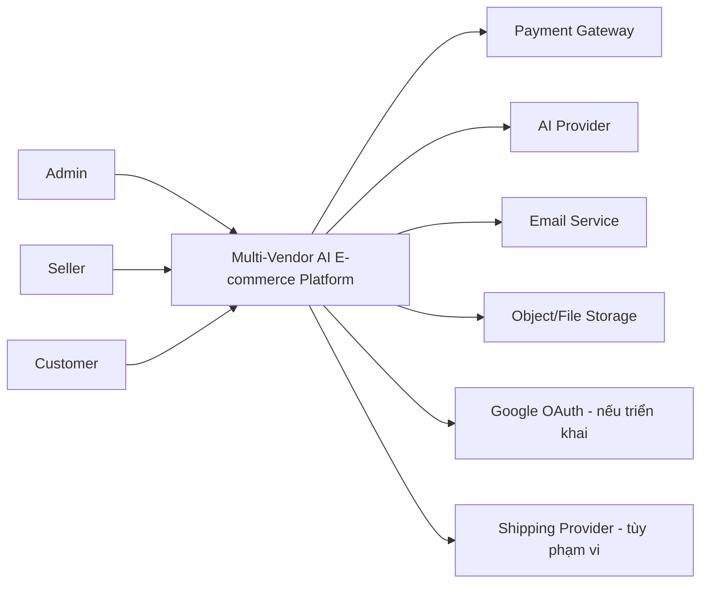

### 3.3. Ma trận quyền cấp cao

| Nhóm chức năng | Admin | Seller | Customer |
|---|:---:|:---:|:---:|
| Quản lý người dùng toàn sàn | ✓ | — | — |
| Quản lý shop | Toàn sàn | Shop của mình | Xem công khai |
| Quản lý sản phẩm | Kiểm duyệt/toàn sàn | Shop của mình | Xem sản phẩm công khai |
| Quản lý kho | Giám sát | Shop của mình | — |
| Đặt hàng | — | — | Đơn của mình |
| Xử lý đơn | Giám sát/can thiệp theo quyền | Phần đơn thuộc shop | Hủy/yêu cầu hoàn theo điều kiện |
| Voucher | Voucher sàn | Voucher shop | Áp dụng hợp lệ |
| Đánh giá | Kiểm duyệt | Trả lời | Viết cho đơn đủ điều kiện |
| Chat | Hỗ trợ/giám sát theo chính sách | Hội thoại của shop | Hội thoại của mình |
| Báo cáo | Toàn sàn | Shop của mình | — |

> Route guard phía Frontend chỉ phục vụ UX. Mọi quyền phải được kiểm tra lại ở Backend.

---

## 4. Nguyên tắc thiết kế bắt buộc

### 4.1. Chất lượng thiết kế

- Readability First.
- Maintainability.
- Scalability.
- Separation of Concerns.
- Áp dụng SOLID khi phù hợp.
- DRY nhưng không trừu tượng hóa quá sớm.
- KISS, không áp dụng design pattern không cần thiết.

### 4.2. Quy tắc phân lớp

```text
Presentation Layer
        ↓
Application Layer
        ↓
Domain Layer
        ↓
Infrastructure Layer
```

- View, Serializer, Consumer và Vue component không chứa business logic chính.
- Business logic đặt trong Service Layer hoặc composable/store phù hợp.
- Truy vấn đọc phức tạp có thể tách vào Selector/Repository.
- Mỗi lớp chỉ phụ thuộc xuống lớp thấp hơn; tránh phụ thuộc ngược không kiểm soát.

### 4.3. Các ràng buộc có mức độ nghiêm trọng cao

- Seller A không bao giờ được đọc hoặc sửa dữ liệu Seller B.
- Tồn kho, ví và điểm không được cập nhật trực tiếp ngoài service chuyên trách.
- Checkout và các thao tác số dư phải chống race condition.
- Webhook thanh toán phải idempotent.
- AI provider lỗi không được làm sập luồng nghiệp vụ chính.
- Không để exception thô, secret hoặc traceback xuất hiện trong response production.

---

## 5. Kiến trúc tổng thể

### 5.1. Container Diagram

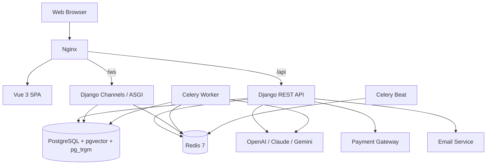

### 5.2. Phong cách kiến trúc

**DECIDED:** Hệ thống sử dụng **Layered Architecture** và tổ chức Backend theo các Django app nghiệp vụ độc lập. Ở quy mô đồ án hiện tại, triển khai theo hướng **modular monolith** là phù hợp: một codebase và database chính, nhưng ranh giới domain phải rõ để có thể tách dịch vụ trong tương lai.

### 5.3. Module cấp cao

| Module | Trách nhiệm |
|---|---|
| Accounts & IAM | Tài khoản, JWT, role, profile, địa chỉ và bảo mật tài khoản. |
| Shops | Seller profile, shop, thành viên shop và cấu hình shop. |
| Catalog | Danh mục, thương hiệu, sản phẩm, SKU, thuộc tính và ảnh. |
| Inventory | Tồn kho, giữ kho, nhập/xuất và lịch sử giao dịch kho. |
| Cart | Giỏ hàng và item theo SKU. |
| Orders | Checkout, đơn tổng, đơn theo shop, item và lịch sử trạng thái. |
| Payments | Yêu cầu thanh toán, callback, giao dịch và hoàn tiền. |
| Promotions | Voucher sàn, voucher shop, điều kiện và lịch sử sử dụng. |
| Reviews | Đánh giá, trả lời, moderation và báo cáo vi phạm. |
| Wishlist | Danh sách yêu thích. |
| Chat | Hội thoại, tin nhắn, trạng thái đọc và realtime. |
| Notifications | Thông báo trong hệ thống và realtime. |
| Reports | Dashboard, aggregate, export và báo cáo. |
| AI | Provider abstraction, request log, embeddings, search và AI features. |
| Audit & Settings | Audit log, SiteSetting, feature flag và cấu hình hệ thống. |

---

## 6. Thiết kế Backend

### 6.1. Cấu trúc Django app chuẩn

```text
apps/
  product/
    models.py
    serializers.py
    views.py
    urls.py
    services.py
    repositories.py
    selectors.py
    permissions.py
    validators.py
    tasks.py
    signals.py
    tests/
```

Không bắt buộc tạo mọi file cho module đơn giản. Chỉ thêm abstraction khi có trách nhiệm thực tế.

### 6.2. Luồng xử lý request

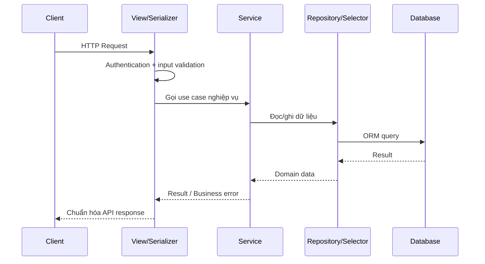

### 6.3. Phân chia trách nhiệm

| Thành phần | Được phép | Không được phép |
|---|---|---|
| View | Nhận request, gọi service, trả response | Chứa quy tắc nghiệp vụ dài hoặc transaction phức tạp |
| Serializer | Validate cấu trúc, format input/output | Tính toán nghiệp vụ đa bước |
| Service | Điều phối use case, transaction, business rule | Phụ thuộc trực tiếp vào HTTP request khi có thể tránh |
| Repository/Selector | Query phức tạp, tối ưu đọc dữ liệu | Quyết định chính sách nghiệp vụ |
| Model | Quan hệ và invariant cục bộ | Trở thành “fat model” chứa toàn bộ use case |
| Task | Chạy tác vụ nền, gọi service | Nhân bản business logic từ service |
| Consumer | Nhận/phát WebSocket | Chứa logic lưu message hoặc phân quyền phức tạp |

### 6.4. Transaction boundary

Các use case sau bắt buộc chạy trong `transaction.atomic()` và có khóa hoặc cập nhật nguyên tử phù hợp:

- trừ, giữ hoặc hoàn tồn kho;
- tạo đơn nhiều item;
- áp voucher có giới hạn lượt;
- cập nhật ví hoặc điểm thưởng;
- xử lý callback thanh toán;
- chuyển trạng thái nhạy cảm có side effect tài chính.

---

## 7. Thiết kế Frontend

### 7.1. Cấu trúc theo domain

```text
src/
  features/
    auth/
    product/
    cart/
    order/
    payment/
    shop/
    seller/
    admin/
    chat/
    notification/
    ai/
  shared/
    components/
    composables/
    lib/
      http.ts
  router/
    guards.ts
  stores/
    auth.ts
```

### 7.2. Quy tắc bắt buộc

- Vue 3 Composition API và `<script setup>`.
- TypeScript strict mode; tránh `any`.
- Component không gọi Axios trực tiếp.
- Mọi API của feature đặt tại `api.ts`.
- State dùng chung qua Pinia store.
- Logic nghiệp vụ hoặc validation phức tạp đặt trong composable/store.
- TypeScript type phải đồng bộ với serializer và OpenAPI của Backend.
- Route guard theo role chỉ là lớp UX, không thay Backend permission.

### 7.3. Trạng thái UI chuẩn

Mọi màn hình dữ liệu phải thiết kế tối thiểu các trạng thái:

- initial/loading;
- success;
- empty;
- validation error;
- permission denied;
- server/network error;
- retry hoặc fallback khi phù hợp.

---

## 8. Authentication, Authorization và Multi-tenant

### 8.1. Mô hình tài khoản

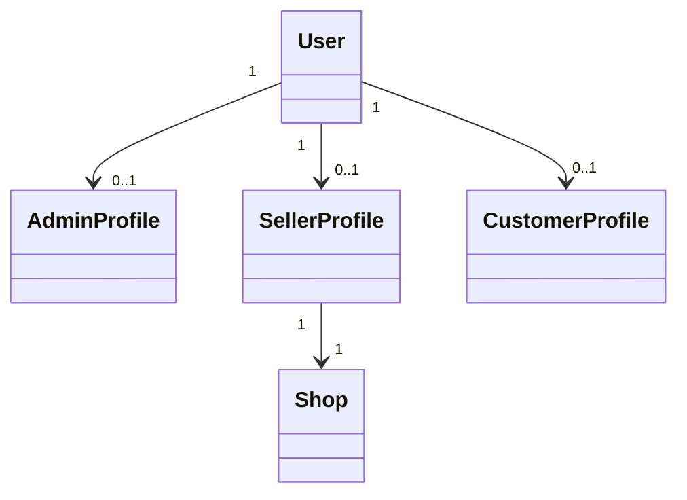

**DECIDED:** JWT access token ngắn hạn + refresh token; refresh rotation và blacklist khi logout.

### 8.2. Luồng xác thực

1. Người dùng đăng nhập.
2. Backend xác thực credential và trạng thái tài khoản.
3. Backend phát access + refresh token.
4. Frontend lưu token theo chính sách bảo mật được chốt trong Detailed Design.
5. Axios interceptor tự refresh khi access token hết hạn.
6. Logout đưa refresh token vào blacklist.

### 8.3. Authorization

- Mỗi endpoint khai báo permission rõ ràng.
- Không hard-code role rải rác; dùng claim JWT hoặc dữ liệu DB và Permission class.
- Object-level permission bắt buộc với đơn hàng, sản phẩm, voucher, kho, review, chat và dữ liệu cá nhân.
- Customer chỉ truy cập dữ liệu của mình.
- Seller chỉ truy cập dữ liệu thuộc shop của mình.

### 8.4. Multi-tenant isolation

```text
request.user
    ↓
seller_profile.shop_id
    ↓
Service/Repository luôn scope queryset theo shop_id này
```

Không sử dụng `shop_id` do client gửi để xác định ownership. `shop_id` trong request chỉ có thể dùng như dữ liệu tham khảo sau khi đã đối chiếu với người dùng đăng nhập.

### 8.5. Permission test bắt buộc

- Seller A không xem được sản phẩm private của Seller B.
- Seller A không sửa hoặc đổi trạng thái đơn của Seller B.
- Customer A không xem đơn, địa chỉ hoặc hội thoại của Customer B.
- Người dùng không thể đổi ID trên URL để vượt quyền.

---

## 9. Thiết kế Realtime

### 9.1. Phạm vi

- chat Customer–Seller;
- thông báo realtime;
- flash sale hoặc dữ liệu realtime nâng cao nếu triển khai nhóm bonus.

### 9.2. Kiến trúc

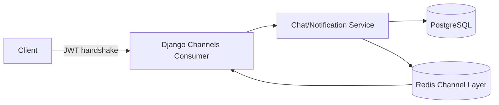

### 9.3. Group naming

- `user_{user_id}` — thông báo cá nhân;
- `shop_{shop_id}` — thông báo shop;
- `conversation_{conversation_id}` — hội thoại.

### 9.4. Quy tắc

- WebSocket phải xác thực ở handshake.
- Consumer chỉ điều phối, không chứa business logic chính.
- Tin nhắn phải được lưu DB trước hoặc cùng transaction logic với broadcast.
- Client reconnect phải tải lại lịch sử và unread state từ REST API.
- Có fallback polling cho notification khi WebSocket không khả dụng.

---

## 10. Thiết kế AI

### 10.1. Kiến trúc AI Service Layer

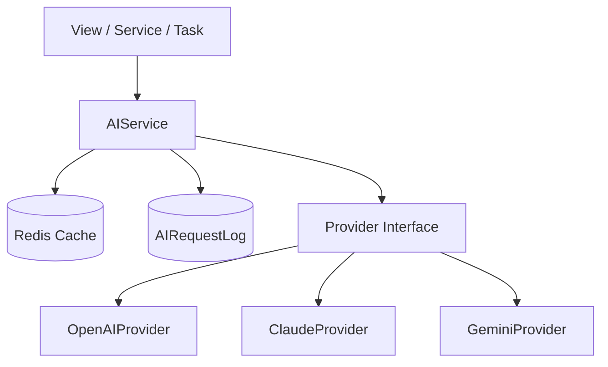

### 10.2. Trách nhiệm của AIService

- timeout và retry có exponential backoff;
- log provider, model, prompt, response, latency, token và lỗi;
- tính và lưu chi phí ước tính;
- cache kết quả theo hash nội dung cho tác vụ ổn định;
- chọn provider/model theo config hoặc feature;
- fallback/degrade gracefully;
- chuẩn hóa lỗi thành `AI_SERVICE_UNAVAILABLE` hoặc lỗi nghiệp vụ tương ứng;
- gắn nhãn nội dung “Tạo bởi AI” khi hiển thị cho người dùng cuối.

### 10.3. Semantic Search

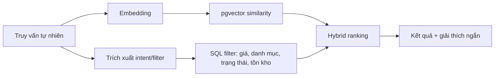

Yêu cầu:

- chỉ trả sản phẩm công khai, đã duyệt và có thể bán;
- filter SQL có tính quyết định với quyền và trạng thái;
- embedding không thay thế kiểm tra tồn kho, giá hoặc quyền;
- có fallback sang tìm kiếm keyword/`pg_trgm` nếu AI hoặc embedding lỗi.

### 10.4. AI Sales Analytics

- SQL hoặc code backend tính chỉ số trước.
- LLM chỉ nhận dữ liệu đã tổng hợp để diễn giải, phát hiện xu hướng hoặc tạo tóm tắt.
- Không dùng kết quả số học do LLM tự tính làm nguồn dữ liệu chính thức.

### 10.5. Feature flag

Các tính năng AI lớn phải bật/tắt được qua `SiteSetting` có cache, không cần deploy lại.

### 10.6. Quyết định chưa chốt

| Quyết định | Trạng thái |
|---|---|
| Provider chính: OpenAI, Claude hoặc Gemini | TBD |
| Embedding model đa ngôn ngữ hỗ trợ tiếng Việt | TBD |
| Ngưỡng similarity và hybrid ranking | TBD |
| Chính sách lưu prompt/response chứa dữ liệu cá nhân | TBD |

---

## 11. Thiết kế dữ liệu mức cơ bản

### 11.1. Quy ước chung

- Mọi bảng có `created_at`, `updated_at`.
- Soft delete dùng đồng thời `is_deleted` và `deleted_at`.
- Tiền dùng `DecimalField`, làm tròn theo đơn vị VNĐ nếu không có yêu cầu khác.
- Thời gian lưu UTC; hiển thị theo UTC+7.
- Ưu tiên Foreign Key.
- Index cho trường truy vấn thường xuyên như `email`, `slug`, `status`, `created_at`.
- Dùng `CheckConstraint` đảm bảo tồn kho hoặc số dư không âm.

### 11.2. Nhóm entity chính

#### Identity

- `User`
- `AdminProfile`
- `SellerProfile`
- `CustomerProfile`
- `Address`

#### Shop và catalog

- `Shop`
- `Category`
- `Brand`
- `Product`
- `ProductVariant`
- `ProductImage`
- `ProductAttribute`
- `ProductAttributeValue`
- `ProductTranslation`

#### Inventory

- `Warehouse` hoặc `ShopInventoryLocation` nếu cần nhiều địa điểm;
- `InventoryBalance`;
- `StockMovement` — append-only;
- `StockEntry`, `StockEntryItem`;
- `StockOutEntry`, `StockOutEntryItem`;
- `StockReservation` — chốt triển khai cùng counter tổng để giữ hàng lúc checkout/thanh toán;
- `StockAlert` — waitlist theo từng user/variant.

#### Commerce

- `Cart`
- `CartItem`
- `Order`
- `ShopOrder`
- `OrderItem`
- `OrderStatusHistory`
- `Payment`
- `PaymentTransaction`
- `Refund`
- `Voucher`
- `VoucherUsage`

#### Engagement

- `Wishlist`
- `WishlistItem`
- `Review`
- `ReviewReply`
- `Conversation`
- `ConversationParticipant`
- `Message`
- `Notification`

#### AI và vận hành

- `ProductEmbedding`
- `AIRequestLog`
- `AIConversation`
- `AIMessage`
- `AuditLog`
- `SiteSetting`

### 11.3. ERD cấp cao

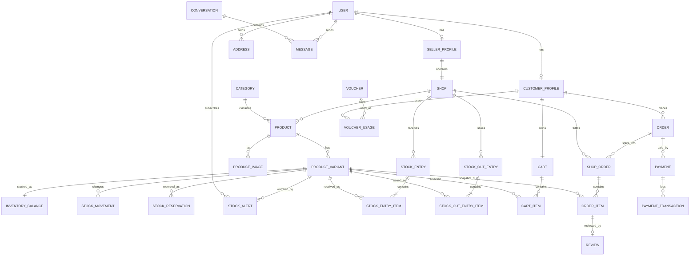

### 11.4. Mô hình đơn nhiều shop

```text
Order (checkout của customer)
├── ShopOrder A
│   ├── OrderItem A1
│   └── OrderItem A2
└── ShopOrder B
    └── OrderItem B1
```

- `Order` đại diện một lần checkout và thanh toán tổng.
- `ShopOrder` đại diện phần fulfillment của từng shop.
- Seller chỉ truy cập `ShopOrder` thuộc shop của mình.
- Giá, tên sản phẩm, thuộc tính SKU và phí phải snapshot vào `OrderItem` để không bị thay đổi theo catalog sau này.

### 11.5. Append-only ledger

| Domain | Service duy nhất | Bảng lịch sử |
|---|---|---|
| Tồn kho | `StockService` | `StockMovement` |
| Ví điện tử, nếu triển khai | `WalletService` | `WalletTransaction` |
| Điểm thưởng, nếu triển khai | `PointService` | `PointTransaction` |

Không service hoặc View nào khác được set trực tiếp `stock`, `balance` hoặc `points`.

---

## 12. Quy tắc nghiệp vụ chính

### 12.1. Sản phẩm

- Seller chỉ tạo/sửa sản phẩm thuộc shop của mình.
- Sản phẩm phải có ít nhất một SKU khả dụng trước khi được bán.
- Sản phẩm chưa duyệt hoặc bị khóa không xuất hiện trong kênh Customer.
- SKU phải có định danh duy nhất trong phạm vi phù hợp.
- Giá bán không âm và sử dụng Decimal.
- Thay đổi sản phẩm không làm thay đổi snapshot của đơn cũ.

### 12.2. Tồn kho

- Tồn kho không âm.
- Mọi biến động tạo `StockMovement`.
- Trừ hoặc giữ tồn kho phải có transaction và row lock/F-expression.
- Hủy hoặc thanh toán thất bại phải hoàn giữ tồn đúng một lần.
- Có test concurrent request chống oversell.

### 12.3. Giỏ hàng

- Một item đại diện một SKU cụ thể.
- Số lượng trong giỏ không được coi là tồn kho đã giữ trừ khi có `StockReservation`.
- Khi mở checkout phải kiểm tra lại giá, trạng thái sản phẩm và tồn kho.
- Item không hợp lệ phải được đánh dấu và yêu cầu Customer cập nhật.

### 12.4. Voucher

- Voucher phải còn hiệu lực, chưa vượt tổng lượt và lượt trên mỗi người dùng.
- Voucher shop chỉ áp dụng cho item của shop đó.
- Voucher sàn áp dụng theo chính sách toàn sàn.
- Việc có cộng dồn voucher shop và voucher sàn hay không là **TBD**.
- Voucher usage phải chống áp dụng trùng trong concurrent checkout.

### 12.5. Đơn hàng

- Một checkout có thể tạo nhiều `ShopOrder`.
- Customer chỉ hủy khi trạng thái và chính sách cho phép.
- Seller chỉ chuyển trạng thái qua các bước hợp lệ.
- Mọi thay đổi trạng thái tạo `OrderStatusHistory`.
- Trạng thái thanh toán và fulfillment là hai khái niệm độc lập nhưng có ràng buộc.

### 12.6. Thanh toán

- COD và một cổng sandbox ngoài COD.
- Callback phải xác minh chữ ký hoặc secret theo provider.
- Callback phải idempotent qua transaction reference unique.
- Lưu payload callback trước hoặc trong quá trình xử lý để audit.
- Không tin trạng thái thanh toán do Frontend gửi.

### 12.7. Review

- Chỉ Customer có OrderItem đủ điều kiện mới được review.
- Chính sách một review cho mỗi OrderItem là PROPOSED.
- Seller được trả lời review thuộc sản phẩm của shop.
- Admin có thể moderation theo quyền và ghi audit log.

### 12.8. Chat

- Chỉ participant hợp lệ được vào conversation group.
- Tin nhắn lưu DB và có timestamp.
- Trạng thái đọc/unread được tính từ dữ liệu bền vững, không chỉ từ WebSocket.

---

## 13. Luồng nghiệp vụ chính

### 13.1. Seller đăng ký và được duyệt

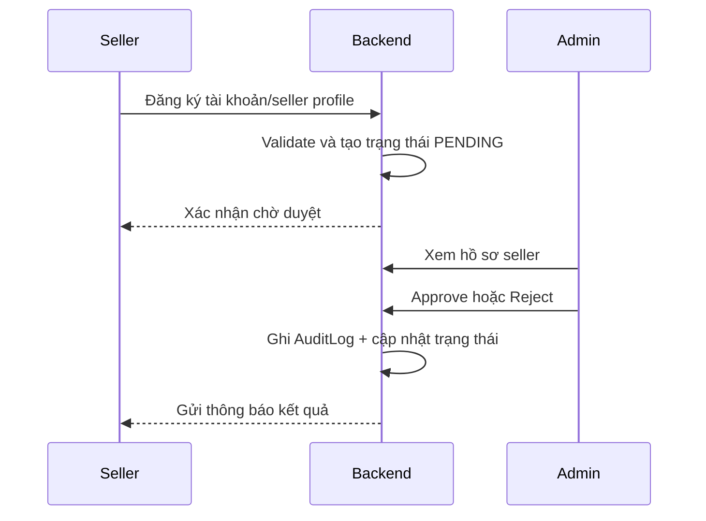

### 13.2. Seller tạo sản phẩm và Admin duyệt

1. Seller nhập thông tin sản phẩm, SKU, ảnh và tồn ban đầu.
2. Backend xác thực ownership và dữ liệu.
3. Sản phẩm lưu ở `DRAFT` hoặc `PENDING_REVIEW`.
4. Admin duyệt hoặc từ chối kèm lý do.
5. Sản phẩm chỉ được public khi trạng thái hợp lệ.
6. Khi nội dung có thay đổi trọng yếu, chính sách có thể yêu cầu duyệt lại — TBD.

### 13.3. Checkout nhiều shop

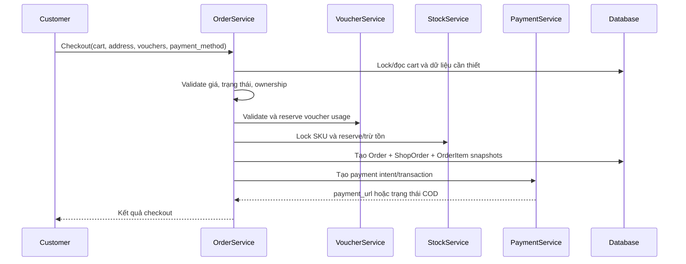

### 13.4. Xử lý callback thanh toán

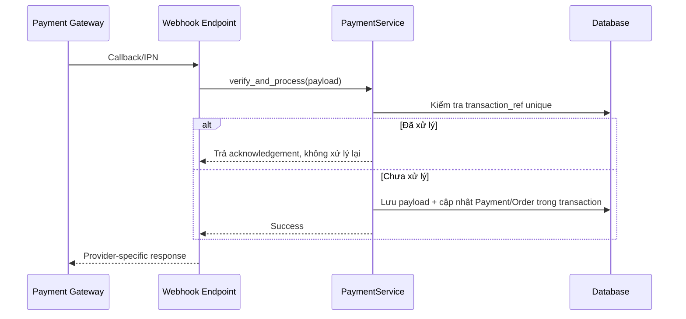

### 13.5. Hủy đơn

- Xác định phạm vi hủy là toàn `Order` hay từng `ShopOrder` — TBD theo đặc tả chi tiết.
- Kiểm tra actor và trạng thái hiện tại.
- Trong transaction:
  - chuyển trạng thái;
  - hoàn tồn hoặc release reservation;
  - hoàn voucher usage nếu chính sách cho phép;
  - tạo refund nếu đã thanh toán;
  - ghi lịch sử và audit.
- Gửi notification bất đồng bộ.

---

## 14. State Machine

### 14.1. Trạng thái sản phẩm đề xuất

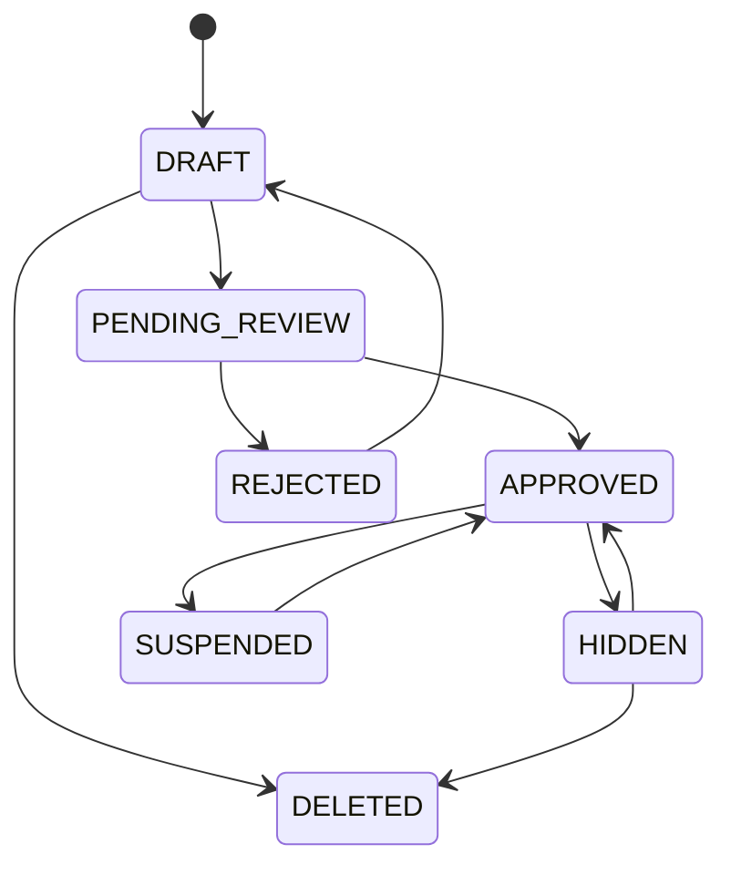

### 14.2. Trạng thái fulfillment đề xuất

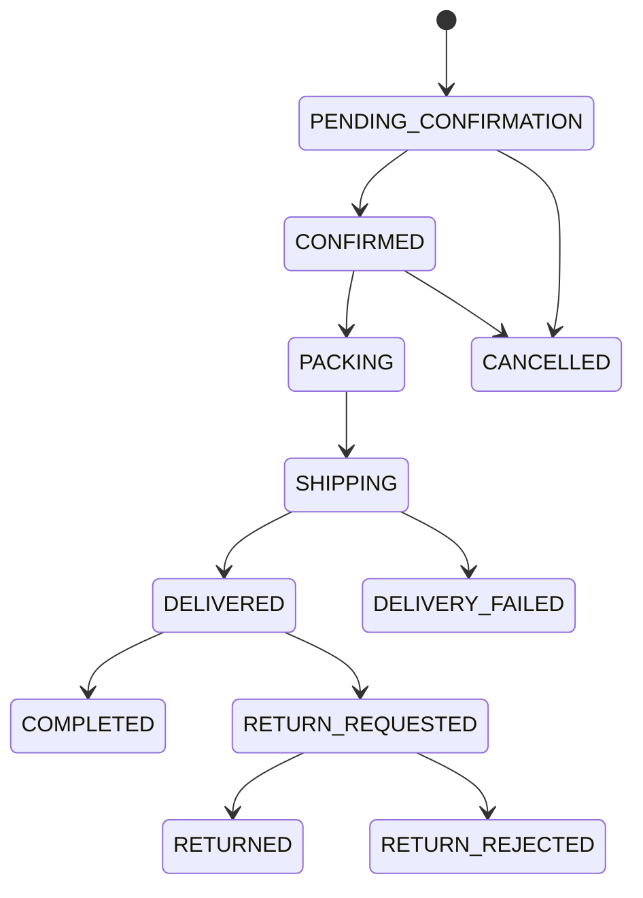

### 14.3. Trạng thái thanh toán đề xuất

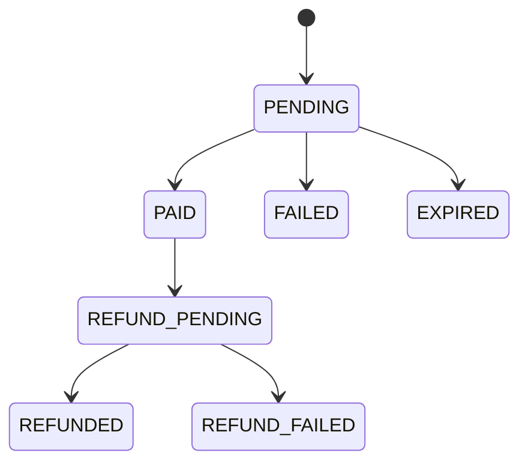

> Danh sách enum cuối cùng và quyền chuyển trạng thái phải được chốt trong Detailed Design của module Order/Payment.

---

## 15. Thiết kế API mức cơ bản

### 15.1. Quy ước chung

- Base path: `/api/v1`.
- RESTful, dùng danh từ số nhiều và kebab-case.
- Mọi list endpoint có phân trang.
- OpenAPI tự sinh bằng `drf-spectacular`.
- Filter, search và sort phải có whitelist rõ ràng.
- Không dùng endpoint kiểu `/getProducts` hoặc `/updateProduct`.

### 15.2. Response thành công

```json
{
  "success": true,
  "message": "Lấy dữ liệu thành công",
  "data": {}
}
```

### 15.3. Response danh sách

```json
{
  "success": true,
  "message": "Lấy danh sách thành công",
  "data": [],
  "meta": {
    "page": 1,
    "page_size": 20,
    "total_items": 134,
    "total_pages": 7
  }
}
```

### 15.4. Response lỗi

```json
{
  "success": false,
  "message": "Dữ liệu không hợp lệ",
  "errors": {
    "price": ["Giá phải lớn hơn 0"]
  }
}
```

### 15.5. Danh mục endpoint cấp cao

#### Authentication

| Method | Endpoint | Actor | Mục đích |
|---|---|---|---|
| POST | `/api/v1/auth/register` | Public | Đăng ký tài khoản. |
| POST | `/api/v1/auth/login` | Public | Đăng nhập. |
| POST | `/api/v1/auth/refresh` | Authenticated token flow | Làm mới access token. |
| POST | `/api/v1/auth/logout` | Authenticated | Blacklist refresh token. |
| POST | `/api/v1/auth/forgot-password` | Public | Khởi tạo khôi phục mật khẩu. |
| POST | `/api/v1/auth/reset-password` | Public/token | Đặt lại mật khẩu. |
| GET/PATCH | `/api/v1/me` | Authenticated | Xem/cập nhật hồ sơ. |

#### Catalog công khai

| Method | Endpoint | Mục đích |
|---|---|---|
| GET | `/api/v1/categories` | Cây/danh sách danh mục. |
| GET | `/api/v1/products` | Tìm kiếm, lọc, sắp xếp và phân trang. |
| GET | `/api/v1/products/{slug}` | Chi tiết sản phẩm công khai. |
| GET | `/api/v1/shops/{slug}` | Trang shop công khai. |

#### Seller

| Method | Endpoint | Mục đích |
|---|---|---|
| GET/POST | `/api/v1/seller/products` | Danh sách/tạo sản phẩm của shop. |
| GET/PATCH/DELETE | `/api/v1/seller/products/{id}` | Quản lý sản phẩm thuộc shop. |
| GET/POST | `/api/v1/seller/products/{id}/variants` | Quản lý SKU. |
| GET | `/api/v1/seller/inventory` | Xem tồn kho. |
| POST | `/api/v1/seller/inventory/movements` | Nhập/xuất/điều chỉnh qua StockService. |
| GET | `/api/v1/seller/orders` | Danh sách ShopOrder. |
| GET | `/api/v1/seller/orders/{id}` | Chi tiết ShopOrder. |
| PATCH | `/api/v1/seller/orders/{id}/status` | Chuyển trạng thái hợp lệ. |
| GET/POST | `/api/v1/seller/vouchers` | Quản lý voucher shop. |
| GET | `/api/v1/seller/dashboard` | KPI và dữ liệu báo cáo. |

#### Customer commerce

| Method | Endpoint | Mục đích |
|---|---|---|
| GET | `/api/v1/cart` | Xem giỏ hàng. |
| POST | `/api/v1/cart/items` | Thêm SKU. |
| PATCH/DELETE | `/api/v1/cart/items/{id}` | Sửa/xóa item. |
| POST | `/api/v1/checkout/preview` | Tính thử giá, voucher và phí. |
| POST | `/api/v1/orders` | Tạo checkout/order. |
| GET | `/api/v1/orders` | Danh sách đơn của Customer. |
| GET | `/api/v1/orders/{id}` | Chi tiết đơn của Customer. |
| POST | `/api/v1/orders/{id}/cancel` | Yêu cầu hủy theo điều kiện. |
| GET/POST | `/api/v1/wishlist/items` | Xem/thêm wishlist. |
| DELETE | `/api/v1/wishlist/items/{id}` | Xóa wishlist item. |
| POST | `/api/v1/order-items/{id}/reviews` | Viết review cho item đủ điều kiện. |

#### Payment

| Method | Endpoint | Mục đích |
|---|---|---|
| POST | `/api/v1/payments/{order_id}/initialize` | Khởi tạo thanh toán nếu tách khỏi checkout. |
| GET | `/api/v1/payments/{id}` | Tra cứu trạng thái. |
| POST | `/api/v1/payment-webhooks/{provider}` | Nhận callback/IPN idempotent. |

#### Chat và notification

| Method | Endpoint | Mục đích |
|---|---|---|
| GET/POST | `/api/v1/conversations` | Danh sách/tạo hội thoại hợp lệ. |
| GET | `/api/v1/conversations/{id}/messages` | Lịch sử tin nhắn. |
| POST | `/api/v1/conversations/{id}/messages` | Gửi fallback qua REST. |
| GET | `/api/v1/notifications` | Danh sách thông báo. |
| PATCH | `/api/v1/notifications/{id}` | Đánh dấu đã đọc. |

#### AI

| Method | Endpoint | Mục đích |
|---|---|---|
| POST | `/api/v1/ai/search` | Smart/semantic search. |
| POST | `/api/v1/ai/chat` | Chatbot tư vấn. |
| POST | `/api/v1/ai/products/{id}/generate-description` | Hỗ trợ Seller. |
| POST | `/api/v1/ai/products/{id}/suggest-tags` | Gợi ý tag/danh mục. |
| POST | `/api/v1/ai/reviews/summary` | Tóm tắt review. |

> Endpoint chính thức phải được sinh và review từ OpenAPI; bảng trên là catalog cấp Basic Design.

### 15.6. Mã lỗi nghiệp vụ đề xuất

| Code | HTTP gợi ý | Ý nghĩa |
|---|---:|---|
| `AUTH_INVALID_CREDENTIALS` | 401 | Sai thông tin đăng nhập. |
| `PERMISSION_DENIED` | 403 | Không đủ quyền. |
| `RESOURCE_NOT_FOUND` | 404 | Không tìm thấy dữ liệu. |
| `OUT_OF_STOCK` | 409 | Không đủ tồn kho. |
| `INVALID_ORDER_STATUS` | 409 | Chuyển trạng thái không hợp lệ. |
| `VOUCHER_INVALID` | 400 | Voucher không hợp lệ. |
| `VOUCHER_LIMIT_REACHED` | 409 | Vượt giới hạn voucher. |
| `PAYMENT_FAILED` | 400/409 | Thanh toán thất bại. |
| `DUPLICATE_PAYMENT_CALLBACK` | 200 acknowledgement | Callback đã xử lý; không xử lý lại. |
| `AI_SERVICE_UNAVAILABLE` | 503 hoặc fallback | AI không khả dụng. |

---

## 16. Thiết kế màn hình mức cơ bản

### 16.1. Customer sitemap

```text
Home
├── Product Listing / Search
├── Product Detail
├── Shop Public Page
├── Wishlist
├── Cart
├── Checkout
├── Payment Result
├── My Orders
│   └── Order Detail
├── Reviews
├── Chat
├── Notifications
└── Account
    ├── Profile
    ├── Addresses
    └── Security
```

### 16.2. Seller sitemap

```text
Seller Dashboard
├── Shop Profile
├── Products
│   ├── Product List
│   ├── Create/Edit Product
│   └── Variants
├── Inventory
│   ├── Current Stock
│   └── Stock Movements
├── Orders
│   └── Order Detail
├── Vouchers
├── Reviews
├── Chat
├── Reports
└── Settings
```

### 16.3. Admin sitemap

```text
Admin Dashboard
├── Users
├── Seller Applications
├── Shops
├── Categories / Brands
├── Product Moderation
├── Orders / Payments
├── Platform Vouchers
├── Reviews / Reports
├── Audit Logs
├── Reports
└── Site Settings / Feature Flags
```

### 16.4. Thông tin cần có cho từng screen specification

| Thuộc tính | Nội dung |
|---|---|
| Screen ID | Mã duy nhất, ví dụ `SCR-SEL-PRODUCT-01`. |
| Actor | Vai trò được truy cập. |
| Mục đích | Nghiệp vụ màn hình. |
| Route | URL Frontend. |
| API | Endpoint sử dụng. |
| Input/filter | Trường nhập và bộ lọc. |
| Action | Hành động và permission. |
| Validation | Quy tắc hiển thị. |
| States | Loading, empty, error, disabled. |
| Responsive | Quy tắc desktop/tablet/mobile. |

---

## 17. Tích hợp bên ngoài

### 17.1. Payment Gateway

Yêu cầu thiết kế:

- provider abstraction để dễ thêm VNPay, MoMo hoặc Stripe test;
- request có transaction reference nội bộ duy nhất;
- verify signature callback;
- timeout và retry phù hợp cho request chủ động;
- callback idempotent;
- mapping trạng thái provider sang trạng thái nội bộ;
- log payload nhưng che dữ liệu nhạy cảm.

**Provider sandbox chính:** VNPay sandbox; COD bắt buộc. Payment gắn với `Order` để một checkout chỉ tạo một giao dịch online.

### 17.2. AI Provider

- chỉ được gọi qua AIService;
- API key từ env;
- provider abstraction;
- timeout, retry, token/cost log, cache và fallback.

### 17.3. Email

- gửi email qua Celery;
- template hóa nội dung;
- retry có giới hạn;
- không làm request chính thất bại nếu gửi email lỗi;
- log message ID và trạng thái, không log secret.

### 17.4. Object/File Storage

Thiết kế phải hỗ trợ:

- validate loại file, kích thước và content-type thực;
- tên file hoặc object key không phụ thuộc tên do client gửi;
- quyền truy cập public/private phù hợp;
- ảnh sản phẩm có thumbnail hoặc tối ưu kích thước nếu phạm vi cho phép.

### 17.5. Google OAuth

Chỉ triển khai nếu nằm trong phạm vi yêu cầu đã chốt. Luồng phải map tài khoản OAuth vào `User`, xử lý email trùng và tài khoản bị khóa.

---

## 18. Cache và Background Jobs

### 18.1. Cache đề xuất

| Dữ liệu | TTL tham khảo | Invalidate |
|---|---:|---|
| Cây danh mục | 1 giờ | Khi Admin thay đổi danh mục. |
| Product detail công khai | 5–15 phút | Khi sản phẩm/SKU/giá/trạng thái thay đổi. |
| Trang chủ hoặc top products | 5–15 phút | TTL hoặc khi aggregate refresh. |
| SiteSetting/feature flag | 1–5 phút | Khi cập nhật setting. |
| AI summary | Theo hash nội dung | Khi nội dung hoặc model version đổi. |
| Search result | Ngắn hạn | Theo query/filter và version index. |

TTL cuối cùng cần đo đạc và chốt trong Detailed Design.

### 18.2. Celery tasks

- gửi email và notification;
- generate embedding/re-index sản phẩm;
- sinh hoặc tóm tắt nội dung AI;
- export Excel;
- tổng hợp dashboard định kỳ;
- hủy payment/order hết hạn;
- release stock reservation hết hạn;
- cleanup dữ liệu tạm;
- backup orchestration hoặc health-related task nếu phù hợp.

### 18.3. Quy tắc task

- task phải idempotent khi có khả năng retry;
- có timeout;
- retry có giới hạn và backoff;
- lưu lỗi quan trọng;
- không truyền object lớn qua broker; truyền ID và tải lại từ DB;
- task gọi lại Service Layer thay vì nhân bản logic.

---

## 19. Yêu cầu phi chức năng

### 19.1. Bảo mật

- JWT và permission rõ ràng.
- Object-level authorization.
- Multi-tenant isolation.
- Không commit `.env`, secret, API key hoặc DB password.
- ORM để phòng SQL injection; raw SQL phải parameterized.
- Sanitize rich-text chống XSS bằng thư viện phù hợp.
- CSRF áp dụng theo cơ chế auth và endpoint liên quan.
- Rate limit login, OTP, reset password và endpoint AI tốn chi phí.
- Validate upload.
- Payment webhook verify signature và idempotent.
- Không trả traceback production.

### 19.2. Hiệu năng

- Mọi list API phân trang.
- Dùng `select_related()`/`prefetch_related()` tránh N+1.
- Dùng Redis cache cho dữ liệu đọc nhiều.
- Tác vụ chậm chuyển sang Celery.
- Index dựa trên query thực tế.
- Search kết hợp PostgreSQL, `pg_trgm` và `pgvector` theo use case.

Các SLA cụ thể như P95 latency, throughput và số concurrent user chưa được tài liệu nguồn chốt, do đó là **TBD**.

### 19.3. Tính sẵn sàng và phục hồi

- Healthcheck riêng cho frontend, backend, worker, beat và Redis.
- PostgreSQL external phải có chính sách backup.
- Các integration phải có timeout và degrade gracefully.
- Notification hoặc AI lỗi không làm rollback nghiệp vụ đã hoàn thành nếu không cần thiết.
- Tài liệu runbook cho các lỗi phổ biến là PROPOSED.

### 19.4. Khả năng bảo trì

- Module theo domain.
- Service Layer rõ ràng.
- API versioning.
- OpenAPI tự sinh.
- Coding standards, lint và test bắt buộc trong CI.
- Cập nhật tài liệu khi thay đổi chức năng.

### 19.5. Internationalization

- Dữ liệu gốc không bị bản dịch AI ghi đè.
- Bản dịch lưu trong `ProductTranslation` theo `lang`.
- Giữ format rich-text khi dịch.
- UI đa ngôn ngữ ngoài tính năng dịch sản phẩm là TBD.

---

## 20. Logging, Audit và Observability

### 20.1. Logging

- Không dùng `print()`.
- Structured logging bằng `logging` hoặc `loguru`.
- Gắn `request_id`, `user_id` và correlation ID khi có thể.
- Log riêng cho payment và AI provider.
- Mask token, password, API key, card data và dữ liệu nhạy cảm.

### 20.2. Audit Log

Các hành động nên audit:

- Admin duyệt/khóa seller;
- Admin duyệt/ẩn sản phẩm;
- thay đổi role hoặc trạng thái tài khoản;
- thao tác điều chỉnh tồn kho thủ công;
- thay đổi cấu hình hoặc feature flag;
- can thiệp trạng thái đơn/thanh toán;
- moderation review hoặc vi phạm.

Dữ liệu tối thiểu:

- actor;
- action;
- object type và object ID;
- before/after ở mức phù hợp;
- timestamp;
- request ID và IP khi được phép;
- lý do nếu là thao tác quản trị nhạy cảm.

### 20.3. Metrics/Monitoring đề xuất

- API error rate và latency;
- task success/failure/retry;
- payment callback failure;
- AI latency, token và cost;
- WebSocket connection count;
- cache hit rate;
- stock conflict/oversell prevented count.

Công cụ monitoring cụ thể là TBD.

---

## 21. Kiến trúc triển khai

### 21.1. Deployment Diagram

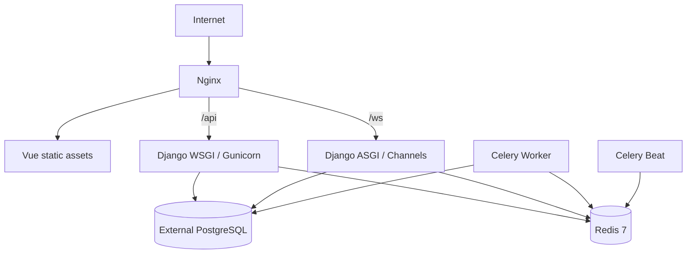

### 21.2. Docker

- `docker-compose` chạy toàn bộ stack bằng một lệnh.
- Frontend và Backend dùng multi-stage Dockerfile.
- PostgreSQL nằm ngoài docker-compose và cấu hình qua env.
- Nginx serve FE và reverse proxy `/api`, `/ws`.
- Mỗi service có healthcheck.
- Không hard-code host, port hoặc secret trong image.

### 21.3. Môi trường

Tối thiểu:

- local/development;
- test/CI;
- staging hoặc demo;
- production nếu triển khai thực tế.

Mỗi môi trường có biến cấu hình riêng, nhưng dùng cùng cấu trúc deployment nhiều nhất có thể.

### 21.4. CI/CD

Pipeline tối thiểu khi push/PR:

#### Backend

- lint bằng `ruff`;
- test bằng `pytest`;
- kiểm tra migration hoặc system check nếu bổ sung.

#### Frontend

- lint bằng ESLint;
- test bằng Vitest;
- build bằng Vite.

Không merge vào `develop` hoặc `main` khi pipeline thất bại. Build Docker image khi merge `main` là khuyến nghị.

---

## 22. Công nghệ

### 22.1. Frontend

| Thành phần | Công nghệ |
|---|---|
| Runtime/build | Node.js 22 LTS, từ 22.12 |
| Framework | Vue 3 |
| Language | TypeScript 5 strict |
| Build tool | Vite 8 |
| State | Pinia 2 |
| Router | Vue Router 4 |
| HTTP | Axios |
| CSS | Tailwind CSS hoặc Bootstrap 5 — TBD |
| Icon | Heroicons hoặc FontAwesome — TBD |
| Chart | Chart.js hoặc ApexCharts — TBD |

### 22.2. Backend

| Thành phần | Công nghệ |
|---|---|
| Language | Python 3.12 |
| Framework | Django 5.x |
| API | Django REST Framework 3.15+ |
| JWT | `djangorestframework-simplejwt` |
| Realtime | Django Channels 4.x |
| Background | Celery + Celery Beat 5.x |
| API docs | `drf-spectacular` |

### 22.3. Data và infrastructure

| Thành phần | Công nghệ |
|---|---|
| Database | PostgreSQL external |
| Text search | `pg_trgm` |
| Vector search | `pgvector` |
| Cache/broker/channel | Redis 7 |
| Reverse proxy | Nginx |
| Container | Docker + docker-compose |
| CI/CD | GitHub Actions khuyến nghị |

---

## 23. Testing Strategy

### 23.1. Loại test

- Unit Test cho service, validator và logic độc lập.
- API Test cho contract, validation và error response.
- Permission Test cho role và object ownership.
- Integration Test cho payment, Redis, Celery và AI provider adapter ở mức phù hợp.
- Frontend component/store test bằng Vitest và Vue Test Utils.
- End-to-end test cho luồng critical là PROPOSED.

### 23.2. Yêu cầu bắt buộc

- Module core `cart`, `checkout`, `voucher`, `inventory` đạt tối thiểu **60% coverage**.
- Có test concurrent request chống oversell.
- Có test Seller A không truy cập dữ liệu Seller B.
- Có test payment callback gọi lặp không tạo giao dịch trùng.
- Không merge khi test fail.

### 23.3. Test case critical tối thiểu

| ID | Test |
|---|---|
| TC-STOCK-01 | Hai request mua SKU cuối cùng đồng thời, chỉ một request thành công. |
| TC-TENANT-01 | Seller A đổi ID URL sang dữ liệu Seller B và nhận 403/404 phù hợp. |
| TC-PAY-01 | Cùng callback gửi hai lần, số dư/trạng thái chỉ cập nhật một lần. |
| TC-ORDER-01 | Checkout nhiều shop tạo đúng ShopOrder và snapshot. |
| TC-VOUCHER-01 | Hai request tranh lượt voucher cuối cùng không vượt limit. |
| TC-AI-01 | AI provider timeout, search fallback hoặc UI degrade nhưng hệ thống không sập. |
| TC-WS-01 | Người ngoài conversation không join hoặc đọc message. |

---

## 24. Traceability

### 24.1. Quy ước mã

- Requirement ID: giữ nguyên mã từ file đặc tả như `ADM-*`, `SEL-*`, `CUS-*`, `AI-*`, `BON-*`, `NFR-*`.
- Use Case ID: `UC-<DOMAIN>-NN`.
- Screen ID: `SCR-<ROLE>-<DOMAIN>-NN`.
- API ID: `API-<DOMAIN>-NN`.
- Test ID: `TC-<DOMAIN>-NN`.

### 24.2. Mẫu ma trận truy vết

| Requirement | Use Case | Screen | API | Entity | Test |
|---|---|---|---|---|---|
| CUS-xx | UC-CART-01 | SCR-CUS-CART-01 | API-CART-01 | Cart, CartItem | TC-CART-01 |
| CUS-xx | UC-ORDER-01 | SCR-CUS-CHECKOUT-01 | API-ORDER-01 | Order, ShopOrder, OrderItem | TC-ORDER-01 |
| SEL-xx | UC-INV-01 | SCR-SEL-INV-01 | API-INV-01 | InventoryBalance, StockMovement | TC-STOCK-01 |
| AI-01/02 | UC-AI-SEARCH-01 | SCR-CUS-SEARCH-01 | API-AI-SEARCH-01 | ProductEmbedding | TC-AI-01 |
| NFR-xx | — | — | Toàn API Seller | Mọi entity tenant | TC-TENANT-01 |

Mã yêu cầu cụ thể cần được điền từ từng sheet của file đặc tả trong bước hoàn thiện Requirement Traceability Matrix.

---

## 25. Rủi ro và biện pháp

| Rủi ro | Mức độ | Biện pháp chính |
|---|---|---|
| Oversell khi concurrent checkout | Rất cao | Transaction, row lock/F-expression, DB constraint và concurrency test. |
| Lộ dữ liệu giữa các shop | Rất cao | Scope query từ `request.user`, object permission và tenant isolation test. |
| Callback thanh toán bị gửi lặp | Rất cao | Unique transaction reference, idempotent service và audit payload. |
| AI lỗi hoặc chi phí tăng | Cao | Timeout, retry, cache, cost log, fallback và feature flag. |
| N+1 query trên catalog/order | Cao | Selector, `select_related`, `prefetch_related`, query test/profiling. |
| Tài liệu lệch code | Trung bình | OpenAPI tự sinh, Definition of Done yêu cầu cập nhật docs. |
| WebSocket mất kết nối | Trung bình | DB là nguồn dữ liệu chính, reconnect sync và polling fallback. |
| Voucher bị dùng vượt giới hạn | Cao | Transaction/lock và unique/ràng buộc phù hợp. |
| Scope 111 yêu cầu quá lớn | Cao | Ưu tiên 65 bắt buộc, chia milestone và feature flag. |

---

## 26. Các quyết định cần chốt

| ID | Quyết định | Trạng thái |
|---|---|---|
| D-01 | Tailwind CSS hay Bootstrap 5 | TBD |
| D-02 | Heroicons hay FontAwesome | TBD |
| D-03 | Chart.js hay ApexCharts | TBD |
| D-04 | AI provider mặc định | TBD |
| D-05 | Embedding model tiếng Việt/đa ngôn ngữ | TBD |
| D-06 | Cổng thanh toán sandbox ngoài COD | Chốt VNPay sandbox |
| D-07 | Voucher sàn và voucher shop có cộng dồn không | Chốt tối đa 1 platform + 1 shop/ShopOrder |
| D-08 | Trừ kho ngay khi tạo đơn hay giữ kho đến khi thanh toán | Chốt reserve lúc checkout, commit khi seller confirm |
| D-09 | Thời gian hết hạn đơn chưa thanh toán | Chốt 15 phút |
| D-10 | Hủy theo Order tổng hay từng ShopOrder | Chốt từng ShopOrder |
| D-11 | Thay đổi sản phẩm đã duyệt có phải duyệt lại không | TBD |
| D-12 | SLA API, số người dùng đồng thời và dung lượng mục tiêu | TBD |
| D-13 | Object storage và email provider | TBD |
| D-14 | Monitoring/error tracking provider | TBD |

Mọi quyết định cần ghi lại lý do, ưu/nhược điểm và tác động trước khi triển khai.

---

## 27. Deliverables liên quan đến thiết kế

- `BASIC_DESIGN.md` — tài liệu hiện tại.
- ERD chi tiết.
- API OpenAPI/Swagger.
- Screen list và wireframe.
- Sequence diagram cho checkout, payment, inventory và AI search.
- Database Design theo module.
- README mỗi module.
- `.env.example`.
- `docker-compose.yml` và deployment guide.
- Seed data cho ba vai trò.
- Test plan và requirement traceability matrix.

---

## 28. Definition of Done cho một chức năng

Một chức năng chỉ được xem là hoàn thành khi:

- [ ] Đã phân tích yêu cầu và liên kết Requirement ID.
- [ ] Đã cập nhật Basic/Detailed Design nếu cần.
- [ ] Đã thiết kế database nếu có dữ liệu mới.
- [ ] Đã thiết kế/cập nhật API nếu có.
- [ ] Đã triển khai đúng kiến trúc Service Layer.
- [ ] Đã xử lý authentication, permission và tenant isolation.
- [ ] Đã xử lý transaction/concurrency nếu có dữ liệu nhạy cảm.
- [ ] Đã xử lý error và logging.
- [ ] Đã viết test cần thiết.
- [ ] Lint, test và build CI thành công.
- [ ] Đã cập nhật tài liệu liên quan.

---

## 29. Thuật ngữ

| Thuật ngữ | Ý nghĩa |
|---|---|
| Marketplace | Sàn có nhiều seller/shop. |
| ShopOrder | Phần đơn hàng do một shop xử lý. |
| SKU / Variant | Biến thể bán cụ thể của sản phẩm. |
| Multi-tenant isolation | Cách ly dữ liệu giữa các shop/người dùng. |
| Idempotency | Xử lý lặp cùng request nhưng không tạo tác dụng phụ lặp. |
| Stock reservation | Giữ một lượng tồn trong thời gian giới hạn. |
| Append-only ledger | Lịch sử giao dịch chỉ thêm mới, không sửa/xóa tùy tiện. |
| Semantic search | Tìm kiếm theo ngữ nghĩa bằng vector embedding. |
| Hybrid search | Kết hợp vector search với keyword/filter SQL. |
| Feature flag | Bật/tắt tính năng bằng cấu hình mà không deploy lại. |
| P95 latency | 95% request có thời gian phản hồi nhỏ hơn hoặc bằng giá trị này. |

---

## 30. Tài liệu liên quan

- `PROJECT_CONSTITUTION.md`
- `ARCHITECTURE.md`
- `CODING_STANDARDS.md`
- `PROJECT_OVERVIEW.md`
- `TECH_STACK.md`
- `Dac-ta-yeu-cau-He-thong-ban-hang-AI.xlsx`

---

**Kết thúc tài liệu.**
