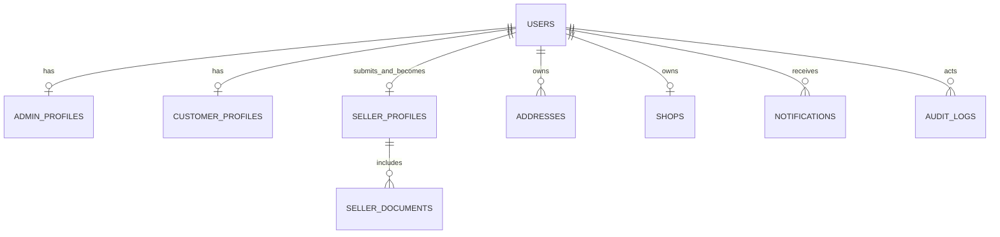
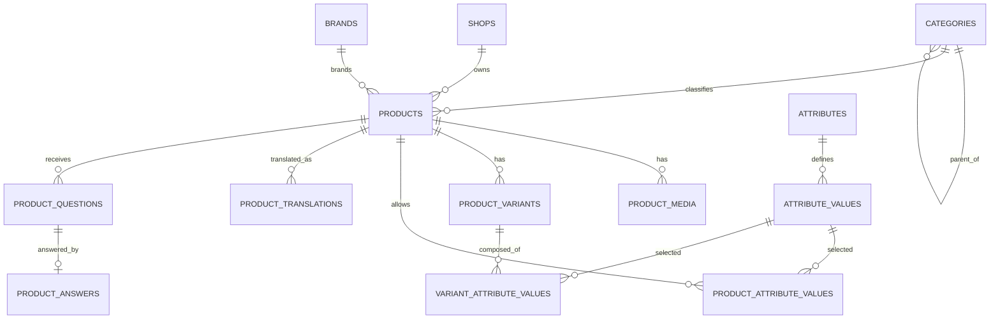
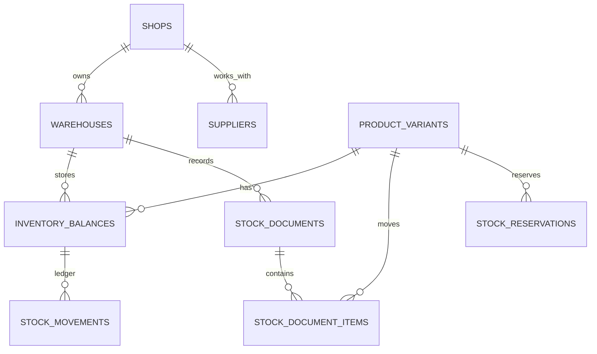
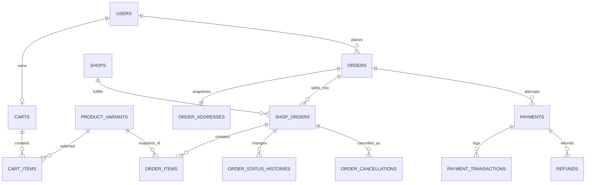
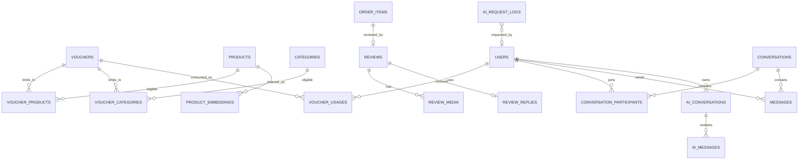

# DATABASE DESIGN — MULTI-VENDOR AI E-COMMERCE PLATFORM

> **Tên file:** `databasedesign.md`  
> **Trạng thái:** Draft — phục vụ thiết kế trước khi triển khai  
> **Phạm vi:** PostgreSQL, dữ liệu nghiệp vụ, ràng buộc toàn vẹn, index, migration và seed data  
> **Hệ thống:** Multi-Vendor AI E-commerce Platform

---

## 0. Quản lý tài liệu

### 0.1. Mục đích

Tài liệu này cụ thể hóa phần thiết kế dữ liệu trong `BASIC_DESIGN.md`, nhằm:

- xác định các domain và bảng dữ liệu của hệ thống;
- mô tả khóa chính, khóa ngoại, ràng buộc và index quan trọng;
- bảo đảm cô lập dữ liệu giữa các shop trong mô hình multi-tenant;
- bảo đảm toàn vẹn tồn kho, voucher, đơn hàng, thanh toán, ví và điểm thưởng;
- làm đầu vào cho Django models, migrations, ERD, seed data và test database;
- tạo cơ sở truy vết từ yêu cầu nghiệp vụ sang entity dữ liệu.

Tài liệu này là **Database Design cấp logic và vật lý sơ bộ**. Chi tiết cuối cùng của từng field phải được đồng bộ với Django model và migration thực tế.

### 0.2. Tài liệu nguồn

| Thứ tự | Tài liệu | Vai trò |
|---:|---|---|
| 1 | `PROJECT_CONSTITUTION.md` | Nguồn thẩm quyền cao nhất về kiến trúc, data integrity, security và quy ước bắt buộc. |
| 2 | `Dac-ta-yeu-cau-He-thong-ban-hang-AI.xlsx` | Nguồn yêu cầu nghiệp vụ và phi chức năng. |
| 3 | `BASIC_DESIGN.md` | Thiết kế tổng thể, luồng nghiệp vụ và danh sách entity cấp cao. |
| 4 | `ARCHITECTURE.md` | Kiến trúc phân lớp, multi-tenant, AI, realtime và deployment. |
| 5 | `CODING_STANDARDS.md` | Quy chuẩn database, naming, concurrency, API và testing. |
| 6 | `TECH_STACK.md` | PostgreSQL, pgvector, Redis và phiên bản công nghệ. |

Khi có xung đột, áp dụng tài liệu có thứ tự ưu tiên cao hơn.

### 0.3. Quy ước trạng thái thiết kế

| Nhãn | Ý nghĩa |
|---|---|
| **CONFIRMED** | Đã được yêu cầu hoặc tài liệu kiến trúc quy định rõ. |
| **PROPOSED** | Đề xuất thiết kế để hiện thực yêu cầu; cần review trước khi code. |
| **TBD** | Chưa đủ thông tin để chốt. |
| **OPTIONAL** | Chỉ tạo khi triển khai tính năng tương ứng. |

Các chi tiết như độ dài chuỗi, UUID, tên enum và một số bảng hỗ trợ không được đặc tả trực tiếp; chúng được ghi là **PROPOSED**, không được xem là yêu cầu gốc.

---

## 1. Nền tảng cơ sở dữ liệu

### 1.1. Công nghệ

| Thành phần | Thiết kế |
|---|---|
| Database chính | PostgreSQL chạy bên ngoài `docker-compose`, kết nối qua biến môi trường. |
| ORM và migration | Django ORM và Django migrations. |
| Tìm kiếm gần đúng | PostgreSQL extension `pg_trgm`. |
| Vector search | PostgreSQL extension `vector` từ pgvector. |
| Cache/broker/realtime | Redis 7.x; **không phải nguồn dữ liệu bền vững**. |
| Múi giờ lưu trữ | UTC; chỉ chuyển sang UTC+7 ở serializer hoặc frontend. |
| Encoding | UTF-8. |

### 1.2. Extension khởi tạo

```sql
CREATE EXTENSION IF NOT EXISTS pg_trgm;
CREATE EXTENSION IF NOT EXISTS vector;
```

Extension phải được kiểm tra trong migration hoặc deployment runbook. Không giả định database production đã bật sẵn.

### 1.3. Nguyên tắc nguồn dữ liệu chính

- PostgreSQL là nguồn dữ liệu chính cho tài khoản, catalog, tồn kho, đơn hàng, thanh toán, chat và notification.
- Redis chỉ dùng cho cache, Celery broker, Channels layer, rate limiting và dữ liệu tạm thời.
- Message realtime phải được lưu vào PostgreSQL trước hoặc trong cùng luồng xử lý hợp lệ trước khi broadcast.
- Không được dùng cache làm nguồn xác định giá thanh toán, tồn kho, quyền truy cập hoặc trạng thái thanh toán.

---

## 2. Quy ước thiết kế chung

### 2.1. Naming convention

| Đối tượng | Quy ước | Ví dụ |
|---|---|---|
| Django model | PascalCase, số ít | `ProductVariant` |
| Tên bảng vật lý | `snake_case`, số nhiều — **PROPOSED** | `product_variants` |
| Tên cột | `snake_case` | `created_at` |
| Foreign key | `<entity>_id` | `shop_id` |
| Unique constraint | `uq_<table>_<columns>` | `uq_products_shop_slug` |
| Check constraint | `ck_<table>_<rule>` | `ck_inventory_non_negative` |
| Index | `ix_<table>_<columns>` | `ix_orders_customer_status` |
| Partial index | thêm hậu tố mô tả điều kiện | `uq_addresses_default_active` |

Nếu dùng tên bảng mặc định của Django thay cho tên đề xuất, phải duy trì mapping rõ ràng trong tài liệu và ERD.

### 2.2. Khóa chính

- **PROPOSED:** dùng UUID cho bảng nghiệp vụ để hạn chế đoán ID qua URL và thuận lợi khi mở rộng.
- Bảng log/sự kiện có thể dùng `bigint` tăng dần nếu cần tối ưu ghi tuần tự.
- Không dùng mã nghiệp vụ như mã đơn, SKU hoặc voucher code làm primary key.
- Mã hiển thị công khai phải tách khỏi khóa chính, ví dụ `order_code`, `shop_order_code`.

### 2.3. Cột dùng chung

Mọi bảng nghiệp vụ thay đổi được phải có:

| Cột | PostgreSQL | Bắt buộc | Mô tả |
|---|---|---:|---|
| `id` | `uuid` | Có | Khóa chính — **PROPOSED**. |
| `created_at` | `timestamptz` | Có | Thời điểm tạo, UTC. |
| `updated_at` | `timestamptz` | Có | Thời điểm cập nhật gần nhất, UTC. |

Bảng cần soft delete sử dụng đồng thời:

| Cột | PostgreSQL | Default | Mô tả |
|---|---|---|---|
| `is_deleted` | `boolean` | `false` | Cờ lọc nhanh, có index khi cần. |
| `deleted_at` | `timestamptz` | `NULL` | Thời điểm xóa mềm. |

Ràng buộc đề xuất:

```sql
CHECK (
    (is_deleted = FALSE AND deleted_at IS NULL)
 OR (is_deleted = TRUE  AND deleted_at IS NOT NULL)
)
```

Không áp dụng soft delete cho ledger append-only như `stock_movements`, `payment_transactions`, `wallet_transactions`, `point_transactions` và `audit_logs`.

### 2.4. Kiểu dữ liệu

| Loại dữ liệu | Thiết kế |
|---|---|
| Tiền VNĐ | `numeric(18,0)` hoặc Django `DecimalField(max_digits=18, decimal_places=0)`. |
| Tỷ lệ phần trăm | `numeric(7,4)` hoặc số nguyên basis point — cần dùng nhất quán. |
| Số lượng tồn | `integer` hoặc `bigint` tùy quy mô; không âm. |
| Trạng thái | `varchar` + Django choices + DB `CheckConstraint`. |
| Metadata linh hoạt | `jsonb`, chỉ dùng cho snapshot, provider payload, diff hoặc dữ liệu khó chuẩn hóa. |
| Nội dung rich text | `text`, phải sanitize ở application layer. |
| IP | `inet`. |
| Vector | `vector(<dimension>)`; dimension chốt theo embedding model — **TBD**. |

Không dùng `float` cho giá, doanh thu, số dư, phí, voucher hoặc hoa hồng.

### 2.5. Quy tắc `NULL`

- Chỉ cho phép `NULL` khi dữ liệu thực sự không tồn tại hoặc chưa biết.
- Trường chuỗi không bắt buộc ưu tiên `NULL`, không đồng thời dùng cả `NULL` và chuỗi rỗng cho cùng một ý nghĩa.
- Trường số tiền bắt buộc dùng `NOT NULL DEFAULT 0` khi số 0 có ý nghĩa nghiệp vụ rõ ràng.
- Foreign key lịch sử có thể `SET NULL` nếu entity catalog bị xóa mềm; snapshot vẫn phải đủ để hiển thị dữ liệu cũ.

### 2.6. JSONB

JSONB chỉ được dùng cho các trường hợp:

- snapshot thuộc tính SKU trong `order_items`;
- payload request/callback của payment provider;
- dữ liệu trước/sau trong `audit_logs`;
- metadata AI hoặc provider;
- cấu hình có schema đơn giản trong `site_settings`.

Không dùng JSONB để thay thế quan hệ chính như product–category, order–item hoặc user–role.

---

## 3. Multi-tenant và bảo mật dữ liệu

### 3.1. Tenant key

- Tenant nghiệp vụ là `shop_id`.
- Mọi bảng thuộc phạm vi seller phải có đường quan hệ rõ ràng đến `shops`.
- Query seller phải lấy `shop_id` từ `request.user`/`seller_profile`, không nhận quyền sở hữu từ request body hoặc query parameter.
- Các API list/detail/update/delete phải scope theo shop trước khi tìm object.

### 3.2. Bảng cần scope theo shop

| Nhóm | Bảng |
|---|---|
| Catalog | `products`, `product_variants`, `product_media`, `product_translations`. |
| Inventory | `warehouses`, `inventory_balances`, `stock_documents`, `stock_movements`. |
| Commerce | `shop_orders`, voucher scope shop, customer aggregates của shop. |
| Engagement | conversation với shop, seller reply/report review. |
| Bonus | flash sale item, bundle, affiliate commission, stock alert. |

### 3.3. Không tin dữ liệu từ client

Các giá trị sau phải được suy ra hoặc xác minh ở backend:

- `shop_id` của seller;
- giá sản phẩm, phí, số tiền giảm và tổng tiền;
- tồn kho khả dụng;
- chủ sở hữu order/cart/review/conversation;
- trạng thái thanh toán;
- vai trò người dùng;
- mã giao dịch của provider và chữ ký callback.

### 3.4. Dữ liệu nhạy cảm

- Mật khẩu chỉ lưu hash theo cơ chế Django.
- Không lưu access token JWT trong bảng nghiệp vụ.
- Refresh token blacklist dùng bảng của `djangorestframework-simplejwt` hoặc cơ chế tương đương.
- Giấy tờ xác minh seller chỉ lưu metadata và đường dẫn object storage; hạn chế quyền đọc.
- Payload payment và AI log phải loại bỏ hoặc mask secret, token, CVV và dữ liệu không cần thiết.

---

## 4. Danh mục domain và bảng

### 4.1. Bảng lõi

| Domain | Bảng chính |
|---|---|
| Identity & Access | `users`, `roles`, `user_roles`, `admin_profiles`, `customer_profiles`, `seller_profiles`, `addresses`. |
| Seller onboarding | `seller_applications`, `seller_verification_documents`, `shops`. |
| Catalog | `categories`, `brands`, `products`, `product_media`, `attributes`, `attribute_values`, `product_attribute_values`, `product_variants`, `variant_attribute_values`, `product_translations`, `product_questions`, `product_answers`. |
| Inventory | `suppliers`, `warehouses`, `inventory_balances`, `stock_documents`, `stock_document_items`, `stock_movements`, `stock_reservations`. |
| Cart | `carts`, `cart_items`. |
| Orders | `orders`, `shop_orders`, `order_items`, `order_addresses`, `order_status_histories`, `order_cancellations`. |
| Returns & disputes | `return_requests`, `return_request_items`, `return_request_media`, `disputes`, `dispute_evidence`. |
| Payment | `payments`, `payment_transactions`, `refunds`. |
| Promotions | `vouchers`, `voucher_products`, `voucher_categories`, `voucher_usages`, `flash_sales`, `flash_sale_items`, `banners`. |
| Review & wishlist | `reviews`, `review_media`, `review_replies`, `review_reports`, `wishlists`, `wishlist_items`. |
| Chat & notification | `conversations`, `conversation_participants`, `messages`, `message_attachments`, `notifications`. |
| AI | `product_embeddings`, `ai_request_logs`, `ai_conversations`, `ai_messages`, `ai_content_cache`. |
| System | `audit_logs`, `site_settings`, `export_jobs`. |

### 4.2. Bảng tùy chọn/bonus

| Tính năng | Bảng đề xuất |
|---|---|
| Theo dõi vận chuyển | `shipments`, `shipment_events`. |
| Follow shop | `shop_followers`. |
| Combo | `bundles`, `bundle_items`. |
| Mua kèm giảm giá | `add_on_deals`, `add_on_deal_items`. |
| Affiliate | `affiliate_links`, `affiliate_clicks`, `commissions`. |
| Điểm thưởng | `point_accounts`, `point_transactions`. |
| Ví nội bộ | `wallets`, `wallet_transactions`. |
| Waitlist | `stock_alerts`. |
| Báo cáo vi phạm generic | `content_reports`. |
| Trending | `product_trending_snapshots`. |

Các bảng bonus chỉ được migration vào nhánh chính khi tính năng tương ứng được đưa vào scope triển khai.

### 4.3. Mapping vật lý đã triển khai — Sprint 2

Thiết kế vật lý hiện dùng primary key `BigAutoField` mặc định Django, không dùng UUID. RBAC dùng
một cột primary role trên `account_user`; bảng `roles`/`user_roles` trong thiết kế dài hạn chưa
được tạo vì Sprint 2 chỉ yêu cầu một trong ba role tại một thời điểm.

| Django model / table | Quan hệ và trường chính | Soft delete / index |
|---|---|---|
| `User` / `account_user` | `role`, `is_active`, `lock_reason`, `must_change_password`, `token_version` | `is_deleted`, `deleted_at`; index email/role/active |
| `SellerProfile` / `account_sellerprofile` | one-to-one User; thông tin doanh nghiệp, onboarding/verification status, reviewer/timestamps | `is_deleted`, `deleted_at`; status + created index |
| `SellerDocument` / `account_sellerdocument` | FK SellerProfile; type, private file path, review status/reason/reviewer | `is_deleted`, `deleted_at`; profile + active index |
| `Shop` / `account_shop` | one-to-one owner User; unique slug; `logo` 512×512, `cover` 1600×480; status pending/approved/rejected/locked; rating | `is_deleted`, `deleted_at`; status + active, created index |
| `Notification` / `account_notification` | FK User; kind, title, message, metadata, read status | `is_deleted`, `deleted_at`; user + read + created index |
| `AuditLog` / `common_auditlog` | actor, action, target type/id, reason, request_id, JSON diff | append-only; actor/target/request indexes |

`SellerProfile` đồng thời là hồ sơ onboarding và hồ sơ seller sau duyệt. Phương án một bảng tránh
copy dữ liệu và quan hệ giấy tờ khi duyệt. Trạng thái cùng reviewer/timestamp giữ lịch sử quyết định;
`AuditLog` giữ diff hành động. Hai URL giấy tờ cũ trên profile được giữ tạm để migration tương thích
nhưng API Sprint 2 chỉ dùng `SellerDocument`.

`SellerDocument.file` dùng tên UUID dưới `private/seller-documents/{user_id}/`. Nginx từ chối
`/media/private/`; serializer có quyền tạo URL download ký số với TTL 5 phút, không lộ storage path.

---

## 5. ERD cấp domain

### 5.1. Identity, seller và shop



Tenant isolation tại Shop không nhận owner từ client. Service/selector resolve `owner=request.user`
trước khi dùng object ID; object permission kiểm tra lại `shop.owner_id == request.user.id`.
Logo và cover dùng `ImageField`; service re-encode WebP kích thước cố định. Hai cột URL cũ được giữ
tạm cho dữ liệu legacy nhưng không còn là input API và sẽ được loại bỏ ở migration dọn dữ liệu sau.

### 5.2. Catalog và biến thể



### 5.3. Inventory



### 5.4. Cart, order và payment



### 5.5. Voucher, review, chat và AI



---

## 6. Identity & Access

### 6.1. `users`

Custom user model của Django; email là định danh đăng nhập.

| Cột | Kiểu | Null | Ràng buộc / index | Mô tả |
|---|---|---:|---|---|
| `id` | `uuid` | Không | PK — PROPOSED | Định danh nội bộ. |
| `email` | `varchar(254)` | Không | Unique, index, chuẩn hóa lowercase | Email đăng nhập. |
| `password` | `varchar(128)` | Không | Django-managed | Password hash. |
| `first_name` | `varchar(150)` | Có |  | Tên. |
| `last_name` | `varchar(150)` | Có |  | Họ. |
| `phone` | `varchar(20)` | Có | Index nếu tìm kiếm thường xuyên | Số điện thoại. |
| `avatar_url` | `text` | Có |  | Đường dẫn avatar. |
| `date_of_birth` | `date` | Có |  | Ngày sinh. |
| `gender` | `varchar(20)` | Có | Check choices | Giới tính theo lựa chọn sản phẩm. |
| `is_active` | `boolean` | Không | Default `true`, index | Khóa/mở tài khoản. |
| `is_staff` | `boolean` | Không | Default `false` | Django admin compatibility. |
| `is_superuser` | `boolean` | Không | Default `false` | Quyền hệ thống đặc biệt. |
| `is_email_verified` | `boolean` | Không | Default `false` | Xác thực email. |
| `must_change_password` | `boolean` | Không | Default `false` | Bắt đổi mật khẩu sau admin reset. |
| `last_login` | `timestamptz` | Có |  | Django-managed. |
| `created_at` | `timestamptz` | Không | Index | Ngày tạo. |
| `updated_at` | `timestamptz` | Không |  | Ngày cập nhật. |
| `is_deleted` | `boolean` | Không | Default `false`, index | Xóa mềm. |
| `deleted_at` | `timestamptz` | Có |  | Thời điểm xóa mềm. |

Ràng buộc:

- email unique không phân biệt hoa thường; chuẩn hóa email trước khi lưu;
- user bị `is_active = false` không được cấp token mới;
- user đã xóa mềm không xuất hiện ở queryset mặc định;
- không hard delete user có order, payment, audit log hoặc message.

### 6.2. `roles`

| Cột | Kiểu | Null | Ràng buộc | Mô tả |
|---|---|---:|---|---|
| `id` | `smallserial` hoặc `uuid` | Không | PK | Định danh role. |
| `code` | `varchar(30)` | Không | Unique | `ADMIN`, `SELLER`, `CUSTOMER`. |
| `name` | `varchar(100)` | Không |  | Tên hiển thị. |
| `description` | `text` | Có |  | Mô tả. |
| `is_system` | `boolean` | Không | Default `true` | Role hệ thống không được xóa. |
| `created_at` | `timestamptz` | Không |  |  |
| `updated_at` | `timestamptz` | Không |  |  |

Ba role gốc được seed. Không hard-code role trong View/Service; permission đọc từ DB hoặc claim JWT đã được phát hành từ DB.

### 6.3. `user_roles`

| Cột | Kiểu | Null | Ràng buộc | Mô tả |
|---|---|---:|---|---|
| `id` | `uuid` | Không | PK |  |
| `user_id` | `uuid` | Không | FK `users`, index | Người dùng. |
| `role_id` | FK | Không | FK `roles` | Role. |
| `assigned_by_id` | `uuid` | Có | FK `users`, `SET NULL` | Admin gán role. |
| `assigned_at` | `timestamptz` | Không | Default now | Thời điểm gán. |
| `revoked_at` | `timestamptz` | Có |  | Thu hồi role nếu cần giữ lịch sử. |

Unique đề xuất: chỉ một role đang hiệu lực cho cùng `(user_id, role_id)`.

> **PROPOSED:** Hệ thống có thể dùng Django Group thay cho `roles`/`user_roles`; nếu vậy phải bảo đảm vẫn đáp ứng gán/thu hồi role và JWT role claim.

### 6.4. `admin_profiles`

| Cột | Kiểu | Null | Ràng buộc | Mô tả |
|---|---|---:|---|---|
| `id` | `uuid` | Không | PK |  |
| `user_id` | `uuid` | Không | One-to-one, unique, FK `users` | User admin. |
| `employee_code` | `varchar(50)` | Có | Unique nếu sử dụng | Mã nội bộ. |
| `created_at` | `timestamptz` | Không |  |  |
| `updated_at` | `timestamptz` | Không |  |  |

### 6.5. `customer_profiles`

| Cột | Kiểu | Null | Ràng buộc | Mô tả |
|---|---|---:|---|---|
| `id` | `uuid` | Không | PK |  |
| `user_id` | `uuid` | Không | One-to-one, unique | User customer. |
| `total_orders` | `integer` | Không | Default 0, check >= 0 | Giá trị cache/denormalized — PROPOSED. |
| `total_spent` | `numeric(18,0)` | Không | Default 0, check >= 0 | Giá trị cache cho báo cáo — PROPOSED. |
| `created_at` | `timestamptz` | Không |  |  |
| `updated_at` | `timestamptz` | Không |  |  |

Nếu không cần số liệu denormalized, `total_orders` và `total_spent` được tính từ order hoàn thành.

### 6.6. `seller_profiles`

| Cột | Kiểu | Null | Ràng buộc | Mô tả |
|---|---|---:|---|---|
| `id` | `uuid` | Không | PK |  |
| `user_id` | `uuid` | Không | One-to-one, unique | User seller. |
| `approved_at` | `timestamptz` | Có |  | Thời điểm được duyệt. |
| `approved_by_id` | `uuid` | Có | FK `users`, `SET NULL` | Admin duyệt. |
| `created_at` | `timestamptz` | Không |  |  |
| `updated_at` | `timestamptz` | Không |  |  |

Trạng thái hồ sơ đăng ký nằm ở `seller_applications`; trạng thái vận hành gian hàng nằm ở `shops`.

### 6.7. `addresses`

| Cột | Kiểu | Null | Ràng buộc / index | Mô tả |
|---|---|---:|---|---|
| `id` | `uuid` | Không | PK |  |
| `user_id` | `uuid` | Không | FK `users`, index | Chủ địa chỉ. |
| `recipient_name` | `varchar(150)` | Không |  | Người nhận. |
| `recipient_phone` | `varchar(20)` | Không |  | SĐT nhận hàng. |
| `province_code` | `varchar(20)` | Không | Index | Mã tỉnh/thành. |
| `district_code` | `varchar(20)` | Không | Index | Mã quận/huyện. |
| `ward_code` | `varchar(20)` | Không |  | Mã phường/xã. |
| `province_name` | `varchar(100)` | Không |  | Snapshot tên. |
| `district_name` | `varchar(100)` | Không |  | Snapshot tên. |
| `ward_name` | `varchar(100)` | Không |  | Snapshot tên. |
| `address_line` | `varchar(255)` | Không |  | Địa chỉ chi tiết. |
| `is_default` | `boolean` | Không | Default `false` | Địa chỉ mặc định. |
| `created_at` | `timestamptz` | Không |  |  |
| `updated_at` | `timestamptz` | Không |  |  |
| `is_deleted` | `boolean` | Không | Default `false` |  |
| `deleted_at` | `timestamptz` | Có |  |  |

Partial unique index:

```sql
CREATE UNIQUE INDEX uq_addresses_user_default_active
ON addresses(user_id)
WHERE is_default = TRUE AND is_deleted = FALSE;
```

---

## 7. Seller onboarding và shop

### 7.1. `seller_applications`

| Cột | Kiểu | Null | Ràng buộc / index | Mô tả |
|---|---|---:|---|---|
| `id` | `uuid` | Không | PK | Hồ sơ đăng ký. |
| `user_id` | `uuid` | Không | FK `users`, index | Người đăng ký. |
| `proposed_shop_name` | `varchar(180)` | Không |  | Tên shop đề xuất. |
| `business_type` | `varchar(30)` | Có | Check choices | Cá nhân/doanh nghiệp. |
| `tax_code` | `varchar(50)` | Có | Index nếu cần | Mã số thuế. |
| `contact_phone` | `varchar(20)` | Không |  | Liên hệ. |
| `contact_address` | `text` | Không |  | Địa chỉ liên hệ. |
| `status` | `varchar(30)` | Không | Index, check | `PENDING`, `APPROVED`, `REJECTED`, `NEED_MORE_INFO`. |
| `review_note` | `text` | Có |  | Lý do từ chối/yêu cầu bổ sung. |
| `reviewed_by_id` | `uuid` | Có | FK `users`, `SET NULL` | Admin xử lý. |
| `reviewed_at` | `timestamptz` | Có |  | Thời điểm xử lý. |
| `created_at` | `timestamptz` | Không | Index |  |
| `updated_at` | `timestamptz` | Không |  |  |

Chỉ một application `PENDING` đang hoạt động cho một user — partial unique index **PROPOSED**.

### 7.2. `seller_verification_documents`

| Cột | Kiểu | Null | Ràng buộc | Mô tả |
|---|---|---:|---|---|
| `id` | `uuid` | Không | PK |  |
| `application_id` | `uuid` | Không | FK `seller_applications`, index | Hồ sơ. |
| `document_type` | `varchar(30)` | Không | Check choices | CCCD, giấy phép KD... |
| `file_url` | `text` | Không |  | URL object storage. |
| `file_name` | `varchar(255)` | Không |  | Tên gốc. |
| `mime_type` | `varchar(100)` | Không |  | Loại file đã xác minh. |
| `size_bytes` | `bigint` | Không | Check > 0 | Dung lượng. |
| `verification_status` | `varchar(30)` | Không | Index | `PENDING`, `VERIFIED`, `REJECTED`. |
| `verification_note` | `text` | Có |  | Ghi chú. |
| `created_at` | `timestamptz` | Không |  |  |
| `updated_at` | `timestamptz` | Không |  |  |

Không lưu binary file trực tiếp trong PostgreSQL.

### 7.3. `shops`

| Cột | Kiểu | Null | Ràng buộc / index | Mô tả |
|---|---|---:|---|---|
| `id` | `uuid` | Không | PK |  |
| `seller_profile_id` | `uuid` | Không | One-to-one, unique | Chủ shop. |
| `name` | `varchar(180)` | Không |  | Tên shop. |
| `slug` | `varchar(200)` | Không | Unique, index | URL công khai. |
| `logo_url` | `text` | Có |  | Logo. |
| `cover_url` | `text` | Có |  | Cover. |
| `description` | `text` | Có |  | Mô tả đã sanitize. |
| `status` | `varchar(30)` | Không | Index, check | `ACTIVE`, `SUSPENDED`, `CLOSED`. |
| `is_verified` | `boolean` | Không | Default `false` | Xác minh giấy tờ. |
| `rating_average` | `numeric(3,2)` | Không | Default 0, check 0..5 | Denormalized — PROPOSED. |
| `rating_count` | `integer` | Không | Default 0, check >= 0 | Denormalized. |
| `commission_rate` | `numeric(7,4)` | Có | Check 0..100 | Override phí sàn nếu có. |
| `created_at` | `timestamptz` | Không | Index |  |
| `updated_at` | `timestamptz` | Không |  |  |
| `is_deleted` | `boolean` | Không | Default `false`, index |  |
| `deleted_at` | `timestamptz` | Có |  |  |

Shop `SUSPENDED` không được tạo/sửa để bán sản phẩm mới, nhưng vẫn phải xem và xử lý các đơn cũ theo chính sách.

---

## 8. Catalog

### 8.1. `categories`

| Cột | Kiểu | Null | Ràng buộc / index | Mô tả |
|---|---|---:|---|---|
| `id` | `uuid` | Không | PK |  |
| `parent_id` | `uuid` | Có | Self FK, index, `RESTRICT` | Danh mục cha. |
| `name` | `varchar(150)` | Không |  | Tên. |
| `slug` | `varchar(180)` | Không | Unique, index | URL. |
| `image_url` | `text` | Có |  | Ảnh. |
| `sort_order` | `integer` | Không | Default 0, index | Thứ tự hiển thị. |
| `is_active` | `boolean` | Không | Default `true`, index | Trạng thái. |
| `created_at` | `timestamptz` | Không |  |  |
| `updated_at` | `timestamptz` | Không |  |  |
| `is_deleted` | `boolean` | Không | Default `false` |  |
| `deleted_at` | `timestamptz` | Có |  |  |

Quy tắc:

- tối thiểu hỗ trợ hai cấp;
- không cho phép vòng lặp cha–con;
- không hard delete category đang được product sử dụng;
- API cây danh mục chỉ trả category active, chưa xóa.

### 8.2. `brands`

| Cột | Kiểu | Null | Ràng buộc | Mô tả |
|---|---|---:|---|---|
| `id` | `uuid` | Không | PK |  |
| `name` | `varchar(150)` | Không | Unique hoặc unique theo canonical name | Tên. |
| `slug` | `varchar(180)` | Không | Unique, index | URL. |
| `logo_url` | `text` | Có |  | Logo. |
| `description` | `text` | Có |  | Mô tả. |
| `is_active` | `boolean` | Không | Default `true`, index |  |
| `created_at` | `timestamptz` | Không |  |  |
| `updated_at` | `timestamptz` | Không |  |  |
| `is_deleted` | `boolean` | Không | Default `false` |  |
| `deleted_at` | `timestamptz` | Có |  |  |

Mapping vật lý triển khai tại `apps.catalog`:

- `Category` và `Brand` dùng UUID primary key và abstract `TimeStampedModel` từ
  `apps.common.models`;
- migration khởi tạo: `catalog.0001_initial`;
- API chỉ soft-delete; Django Admin không cung cấp hard-delete;
- `CategoryService` chặn cycle và chặn soft-delete khi còn category con hoặc Product active;
- FK `Product.category` dùng `PROTECT` để chặn hard-delete Category đang được Product sử dụng.

### 8.3. `products`

| Cột | Kiểu | Null | Ràng buộc / index | Mô tả |
|---|---|---:|---|---|
| `id` | `uuid` | Không | PK |  |
| `shop_id` | `uuid` | Không | FK `shops`, index | Tenant owner. |
| `category_id` | `uuid` | Không | FK `categories`, index | Danh mục. |
| `brand_id` | `uuid` | Có | FK `brands`, index | Thương hiệu. |
| `name` | `varchar(255)` | Không | Trigram/search index | Tên sản phẩm. |
| `slug` | `varchar(280)` | Không | Unique `(shop_id, slug)` | URL trong shop. |
| `short_description` | `text` | Có |  | Mô tả ngắn. |
| `description` | `text` | Có |  | Rich text đã sanitize. |
| `status` | `varchar(30)` | Không | Index, check | `DRAFT`, `PENDING_REVIEW`, `APPROVED`, `REJECTED`, `HIDDEN`, `SUSPENDED`. |
| `rejection_reason` | `text` | Có |  | Lý do từ chối. |
| `approved_by_id` | `uuid` | Có | FK `users`, `SET NULL` | Admin duyệt. |
| `approved_at` | `timestamptz` | Có |  |  |
| `rating_average` | `numeric(3,2)` | Không | Default 0, check 0..5 | Denormalized. |
| `rating_count` | `integer` | Không | Default 0 | Denormalized. |
| `sold_count` | `bigint` | Không | Default 0 | Denormalized, chỉ cập nhật từ order hoàn thành. |
| `min_price` | `numeric(18,0)` | Có | Check >= 0 | Cache giá variant thấp nhất. |
| `max_price` | `numeric(18,0)` | Có | Check >= 0 | Cache giá variant cao nhất. |
| `search_document` | `tsvector` | Có | GIN index — PROPOSED | Full-text search. |
| `created_at` | `timestamptz` | Không | Index |  |
| `updated_at` | `timestamptz` | Không | Index | Dùng cho re-index AI. |
| `is_deleted` | `boolean` | Không | Default `false`, index |  |
| `deleted_at` | `timestamptz` | Có |  |  |

Ràng buộc:

- `min_price <= max_price` khi cả hai có giá trị;
- product public phải đồng thời: product approved, shop active, category active, chưa xóa;
- thay đổi lớn sau duyệt có phải quay lại `PENDING_REVIEW` là **TBD**;
- không hard delete product đã xuất hiện trong order item.

Index đề xuất:

```sql
CREATE INDEX ix_products_public_feed
ON products(status, created_at DESC)
WHERE is_deleted = FALSE;

CREATE INDEX ix_products_name_trgm
ON products USING gin (name gin_trgm_ops);

CREATE INDEX ix_products_search_document
ON products USING gin (search_document);
```

### 8.4. `product_media`

| Cột | Kiểu | Null | Ràng buộc | Mô tả |
|---|---|---:|---|---|
| `id` | `uuid` | Không | PK |  |
| `product_id` | `uuid` | Không | FK `products`, index | Product. |
| `variant_id` | `uuid` | Có | FK `product_variants`, index | Ảnh riêng variant. |
| `media_type` | `varchar(20)` | Không | Check `IMAGE`, `VIDEO` | Loại. |
| `file_url` | `text` | Không |  | File gốc. |
| `thumbnail_url` | `text` | Có |  | Thumbnail. |
| `alt_text` | `varchar(255)` | Có |  | SEO/accessibility. |
| `sort_order` | `smallint` | Không | Default 0 | Thứ tự. |
| `is_primary` | `boolean` | Không | Default `false` | Ảnh đại diện. |
| `created_at` | `timestamptz` | Không |  |  |
| `updated_at` | `timestamptz` | Không |  |  |

Quy tắc 9 ảnh + 1 video được kiểm tra ở Service Layer; partial unique chỉ cho một media primary trên mỗi product.

### 8.5. `attributes`

| Cột | Kiểu | Null | Ràng buộc | Mô tả |
|---|---|---:|---|---|
| `id` | `uuid` | Không | PK |  |
| `shop_id` | `uuid` | Có | FK `shops`, index | `NULL` nếu thuộc tính toàn sàn — PROPOSED. |
| `name` | `varchar(100)` | Không | Unique `(shop_id, name)` | Ví dụ Màu, Size. |
| `code` | `varchar(100)` | Không | Unique `(shop_id, code)` | Mã ổn định. |
| `display_type` | `varchar(20)` | Không | Check | Text, color, image... |
| `sort_order` | `integer` | Không | Default 0 |  |
| `created_at` | `timestamptz` | Không |  |  |
| `updated_at` | `timestamptz` | Không |  |  |

### 8.6. `attribute_values`

| Cột | Kiểu | Null | Ràng buộc | Mô tả |
|---|---|---:|---|---|
| `id` | `uuid` | Không | PK |  |
| `attribute_id` | `uuid` | Không | FK `attributes`, index |  |
| `value` | `varchar(120)` | Không | Unique `(attribute_id, value)` | Giá trị. |
| `display_value` | `varchar(120)` | Có |  | Tên hiển thị. |
| `color_code` | `varchar(20)` | Có |  | Mã màu nếu có. |
| `sort_order` | `integer` | Không | Default 0 |  |
| `created_at` | `timestamptz` | Không |  |  |
| `updated_at` | `timestamptz` | Không |  |  |

### 8.7. `product_attribute_values`

Danh sách giá trị thuộc tính được phép dùng cho một product.

| Cột | Kiểu | Null | Ràng buộc |
|---|---|---:|---|
| `id` | `uuid` | Không | PK |
| `product_id` | `uuid` | Không | FK `products`, index |
| `attribute_value_id` | `uuid` | Không | FK `attribute_values` |
| `created_at` | `timestamptz` | Không |  |
| `updated_at` | `timestamptz` | Không | Bổ sung theo Constitution mục 9 |

Unique `(product_id, attribute_value_id)`.

### 8.8. `product_variants`

| Cột | Kiểu | Null | Ràng buộc / index | Mô tả |
|---|---|---:|---|---|
| `id` | `uuid` | Không | PK |  |
| `product_id` | `uuid` | Không | FK `products`, index | Product. |
| `shop_id` | `uuid` | Không | FK `shops`, index | Denormalized để unique SKU trong shop. |
| `sku` | `varchar(100)` | Không | Unique `(shop_id, sku)` | SKU. |
| `barcode` | `varchar(100)` | Có | Unique `(shop_id, barcode)` khi không null | Barcode. |
| `name` | `varchar(255)` | Có |  | Tên tổ hợp. |
| `original_price` | `numeric(18,0)` | Không | Check >= 0 | Giá gốc. |
| `sale_price` | `numeric(18,0)` | Không | Check >= 0 | Giá bán. |
| `cost_price` | `numeric(18,0)` | Có | Check >= 0 | Giá vốn, chỉ seller/admin thấy. |
| `weight_grams` | `integer` | Có | Check > 0 | Trọng lượng. |
| `is_active` | `boolean` | Không | Default `true`, index | Đang bán. |
| `created_at` | `timestamptz` | Không |  |  |
| `updated_at` | `timestamptz` | Không | Index |  |
| `is_deleted` | `boolean` | Không | Default `false` |  |
| `deleted_at` | `timestamptz` | Có |  |  |

Ràng buộc:

```sql
CHECK (sale_price <= original_price OR original_price = 0)
```

Sự nhất quán `product.shop_id = variant.shop_id` phải được Service Layer kiểm tra; có thể bổ sung DB trigger nếu cần bảo vệ mạnh hơn.

### 8.9. `variant_attribute_values`

| Cột | Kiểu | Null | Ràng buộc |
|---|---|---:|---|
| `id` | `uuid` | Không | PK |
| `variant_id` | `uuid` | Không | FK `product_variants`, index |
| `attribute_id` | `uuid` | Không | FK `attributes` |
| `attribute_value_id` | `uuid` | Không | FK `attribute_values` |
| `created_at` | `timestamptz` | Không |  |
| `updated_at` | `timestamptz` | Không | Bổ sung theo Constitution mục 9 |

Unique:

- `(variant_id, attribute_id)` — mỗi variant chỉ có một giá trị cho một thuộc tính;
- `(variant_id, attribute_value_id)`.

### 8.9.1. Mapping vật lý đã triển khai — Product schema

- App: `apps.product`; migration: `product.0001_initial`.
- Các model: `Product`, `ProductMedia`, `Attribute`, `AttributeValue`,
  `ProductAttributeValue`, `ProductVariant`, `VariantAttributeValue`.
- `ix_products_public_feed` là partial index trên `(status, created_at DESC)` khi
  `is_deleted = false`.
- Product slug dùng partial unique `(shop_id, slug)` khi chưa xóa.
- Attribute global và Attribute theo Shop dùng các partial unique riêng để xử lý đúng
  semantics của `NULL`.
- `ProductService`, `MediaService`, `VariantService` và `ProductStateMachine` là write path duy
  nhất cho business rule Product; các thao tác nhiều bước dùng transaction và row lock.
- Mọi write path của Seller khóa Product/Variant bằng đồng thời primary key và `shop_id` suy ra từ
  authenticated user; `shop_id` trên object/request body không được tin cậy.
- `VariantService.validate_shop_consistency()` bảo vệ invariant
  `product.shop_id = variant.shop_id`; SKU/barcode unique theo Shop và giá cache được tính lại từ
  variants active, chưa xóa.
- Rich text được sanitize bằng allow-list trước khi lưu. `MediaService` xác minh magic bytes/Pillow,
  giới hạn 9 ảnh + 1 video, và lưu qua Django Storage.
- `ProductStateMachine` triển khai đúng transition tại BASIC_DESIGN §14.1; approve/reject/hide ghi
  `AuditLog` với UUID Product dưới dạng chuỗi. Migration `common.0003` đổi `AuditLog.target_id`
  sang `varchar(64)` để hỗ trợ đồng thời ID số và UUID.
- `serializers.py`, `views.py`, `permissions.py` và `urls.py` đã nối Seller/Admin/Public API.
  `ProductSelector` giữ filter/search/sort và eager loading; View không chứa business write.
- `IsShopOwner` dùng quan hệ vật lý `Shop.owner` và mọi nested Media/Variant endpoint lấy Product
  từ Seller-scoped queryset trước khi xử lý object con.

### 8.10. `product_translations` — OPTIONAL

| Cột | Kiểu | Null | Ràng buộc |
|---|---|---:|---|
| `id` | `uuid` | Không | PK |
| `product_id` | `uuid` | Không | FK `products`, index |
| `language_code` | `varchar(10)` | Không | Unique `(product_id, language_code)` |
| `name` | `varchar(255)` | Không |  |
| `short_description` | `text` | Có |  |
| `description` | `text` | Có |  |
| `generated_by_ai` | `boolean` | Không | Default `false` |
| `source_hash` | `varchar(64)` | Có | Cache invalidation |
| `created_at` | `timestamptz` | Không |  |
| `updated_at` | `timestamptz` | Không |  |

Bản dịch không ghi đè bản gốc và phải giữ cấu trúc rich text.

### 8.11. `product_questions` và `product_answers`

`product_questions`:

| Cột | Kiểu | Null | Ràng buộc |
|---|---|---:|---|
| `id` | `uuid` | Không | PK |
| `product_id` | `uuid` | Không | FK, index |
| `customer_id` | `uuid` | Không | FK `users`, index |
| `content` | `text` | Không |  |
| `status` | `varchar(20)` | Không | `VISIBLE`, `HIDDEN` |
| `created_at` | `timestamptz` | Không | Index |
| `updated_at` | `timestamptz` | Không |  |

`product_answers`:

| Cột | Kiểu | Null | Ràng buộc |
|---|---|---:|---|
| `id` | `uuid` | Không | PK |
| `question_id` | `uuid` | Không | One-to-one, unique |
| `seller_user_id` | `uuid` | Không | FK `users` |
| `content` | `text` | Không |  |
| `created_at` | `timestamptz` | Không |  |
| `updated_at` | `timestamptz` | Không |  |

Seller chỉ được trả lời câu hỏi của product thuộc shop mình.

---

## 9. Inventory

### 9.1. Quyết định mô hình chứng từ kho

Sprint 4 đã chốt dùng hai loại chứng từ riêng:

- `stock_entries`/`stock_entry_items` cho nhập hàng có nhà cung cấp và giá nhập;
- `stock_out_entries`/`stock_out_entry_items` cho xuất kho hoặc kiểm kê;
- cả hai đi qua `DRAFT → CONFIRMED`; phiếu confirmed không sửa;
- chỉ `StockService` được khóa `inventory_balances`, đổi counter và ghi `stock_movements`.

Một shop hiện có một balance trên mỗi variant. `Warehouse`/`Supplier` chuẩn hóa thành bảng riêng
được deferred; Sprint 4 lưu `supplier_name` snapshot trên phiếu nhập.

### 9.2. `suppliers`

| Cột | Kiểu | Null | Ràng buộc |
|---|---|---:|---|
| `id` | `uuid` | Không | PK |
| `shop_id` | `uuid` | Không | FK `shops`, index |
| `name` | `varchar(180)` | Không | Unique `(shop_id, name)` |
| `phone` | `varchar(20)` | Có |  |
| `email` | `varchar(254)` | Có |  |
| `address` | `text` | Có |  |
| `created_at` | `timestamptz` | Không |  |
| `updated_at` | `timestamptz` | Không |  |
| `is_deleted` | `boolean` | Không | Default `false` |
| `deleted_at` | `timestamptz` | Có |  |

### 9.3. `warehouses`

| Cột | Kiểu | Null | Ràng buộc | Mô tả |
|---|---|---:|---|---|
| `id` | `uuid` | Không | PK |  |
| `shop_id` | `uuid` | Không | FK, index | Shop. |
| `name` | `varchar(150)` | Không | Unique `(shop_id, name)` | Tên kho. |
| `code` | `varchar(50)` | Không | Unique `(shop_id, code)` | Mã kho. |
| `address` | `text` | Có |  | Địa chỉ. |
| `is_default` | `boolean` | Không | Default `false` | Kho mặc định. |
| `is_active` | `boolean` | Không | Default `true` |  |
| `created_at` | `timestamptz` | Không |  |  |
| `updated_at` | `timestamptz` | Không |  |  |

**Deferred:** Sprint 4 chưa triển khai nhiều kho. Khi bổ sung `Warehouse`, cần migration từ
OneToOne `(variant)` sang unique `(warehouse, variant)` mà không thay đổi ledger hiện hữu.

### 9.4. `inventory_balances`

| Cột | Kiểu | Null | Ràng buộc / index | Mô tả |
|---|---|---:|---|---|
| `id` | `bigserial` | Không | PK |  |
| `variant_id` | `uuid` | Không | One-to-one FK | SKU. |
| `available_stock` | `integer` | Không | Default 0, check >= 0 | Có thể bán/giữ. |
| `reserved_stock` | `integer` | Không | Default 0, check >= 0 | Tổng đang giữ. |
| `low_stock_threshold` | `integer` | Không | Default 5, check >= 0 | Ngưỡng cảnh báo. |
| `created_at` | `timestamptz` | Không |  |  |
| `updated_at` | `timestamptz` | Không | Index |  |

Check:

```sql
CHECK (available_stock >= 0),
CHECK (reserved_stock >= 0),
CHECK (low_stock_threshold >= 0)
```

Hai counter không nhận từ client và luôn thay đổi đồng thời với ledger qua `StockService`.

### 9.5. `stock_entries`

| Cột | Kiểu | Null | Ràng buộc / index | Mô tả |
|---|---|---:|---|---|
| `id` | `bigserial` | Không | PK |  |
| `shop_id` | `uuid` | Không | FK, index | Tenant. |
| `supplier_name` | `varchar(255)` | Không |  | Snapshot nhà cung cấp. |
| `status` | `varchar(20)` | Không | Index | `DRAFT`, `CONFIRMED`. |
| `note` | `text` | Có |  |  |
| `confirmed_by_id` | `uuid` | Có | FK `users`, `PROTECT` | Người xác nhận. |
| `confirmed_at` | `timestamptz` | Có |  |  |
| `created_by_id` | `uuid` | Không | FK `users`, `PROTECT` | Người tạo. |
| `created_at` | `timestamptz` | Không | Index |  |
| `updated_at` | `timestamptz` | Không |  |  |

Phiếu đã `CONFIRMED` không được sửa/xóa; muốn đảo phải tạo chứng từ bù.

### 9.6. `stock_entry_items`

| Cột | Kiểu | Null | Ràng buộc |
|---|---|---:|---|
| `id` | `bigserial` | Không | PK |
| `stock_entry_id` | `bigint` | Không | FK `stock_entries` |
| `variant_id` | `uuid` | Không | FK `product_variants`, index |
| `quantity` | `integer` | Không | Check > 0 |
| `unit_cost` | `numeric(18,0)` | Không | Check >= 0 |
| `created_at` | `timestamptz` | Không |  |
| `updated_at` | `timestamptz` | Không |  |

Unique `(stock_entry_id, variant_id)`.

`stock_out_entries` có `entry_type = OUT | ADJUSTMENT`, `reason` bắt buộc và cùng các cột
status/audit như `stock_entries`. `stock_out_entry_items.quantity` là lượng xuất khi `OUT`, hoặc
số tồn thực tế mới khi `ADJUSTMENT`; unique `(stock_out_entry_id, variant_id)`.

### 9.7. `stock_movements`

Ledger append-only; không update, không delete.

| Cột | Kiểu | Null | Ràng buộc / index | Mô tả |
|---|---|---:|---|---|
| `id` | `bigserial` | Không | PK |  |
| `variant_id` | `uuid` | Không | FK, index | Dùng truy vấn sổ kho. |
| `movement_type` | `varchar(20)` | Không | Index | `IN`, `OUT`, `ADJUSTMENT`, `RESERVE`, `RELEASE`, `COMMIT`. |
| `bucket` | `varchar(20)` | Không | Check choices | `AVAILABLE` hoặc `RESERVED`. |
| `quantity` | `integer` | Không | Check != 0 | Delta signed của bucket. |
| `balance_after` | `integer` | Không | Check >= 0 | Số dư bucket sau giao dịch. |
| `reference_type` | `varchar(20)` | Không |  | `STOCK_ENTRY`, `STOCK_OUT`, `ADJUSTMENT`, `ORDER`. |
| `reference_id` | `varchar(64)` | Không | Composite index | ID/mã nguồn. |
| `note` | `text` | Có |  |  |
| `created_by_id` | `uuid` | Không | FK `users`, `PROTECT` | Người/hệ thống thực hiện. |
| `created_at` | `timestamptz` | Không | Index | Thời điểm. |
| `updated_at` | `timestamptz` | Không |  | Bắt buộc theo quy ước bảng. |

Mọi thay đổi tồn phải đi qua `StockService` trong `transaction.atomic()` với `select_for_update()` hoặc `F()` expression.

### 9.8. `stock_reservations`

Sprint 4 chốt triển khai cả counter tổng và reservation chi tiết.

| Cột | Kiểu | Null | Ràng buộc |
|---|---|---:|---|
| `id` | `bigserial` | Không | PK |
| `variant_id` | `uuid` | Không | FK, index |
| `order_reference` | `varchar(64)` | Không | Unique cùng variant |
| `quantity` | `integer` | Không | Check > 0 |
| `status` | `varchar(20)` | Không | `ACTIVE`, `RELEASED`, `COMMITTED`, `EXPIRED` |
| `expires_at` | `timestamptz` | Có | Index |
| `created_at` | `timestamptz` | Không |  |
| `updated_at` | `timestamptz` | Không |  |

Celery Beat có thể giải phóng reservation hết hạn theo idempotent service.

### 9.9. `stock_alerts`

| Cột | Kiểu | Null | Ràng buộc |
|---|---|---:|---|
| `id` | `bigserial` | Không | PK |
| `variant_id` | `uuid` | Không | FK |
| `user_id` | `uuid` | Không | FK |
| `is_notified` | `boolean` | Không | Default false, index |
| `created_at` | `timestamptz` | Không | Index |
| `updated_at` | `timestamptz` | Không |  |

Unique `(variant_id, user_id)`. Khi available chuyển `0 → >0`, notification được tạo và flag
được cập nhật trong cùng transaction; email chỉ được enqueue sau commit.

---

## 10. Cart

### 10.1. `carts`

| Cột | Kiểu | Null | Ràng buộc |
|---|---|---:|---|
| `id` | `uuid` | Không | PK |
| `user_id` | `uuid` | Không | One-to-one active cart, FK `users` |
| `status` | `varchar(20)` | Không | `ACTIVE`, `CONVERTED`, `ABANDONED` |
| `created_at` | `timestamptz` | Không |  |
| `updated_at` | `timestamptz` | Không | Index |

Guest cart lưu localStorage và merge vào cart DB khi đăng nhập. Database không lưu guest cart trừ khi sau này thêm session cart.

### 10.2. `cart_items`

| Cột | Kiểu | Null | Ràng buộc / index | Mô tả |
|---|---|---:|---|---|
| `id` | `uuid` | Không | PK |  |
| `cart_id` | `uuid` | Không | FK, index |  |
| `variant_id` | `uuid` | Không | FK, index | SKU. |
| `quantity` | `integer` | Không | Check > 0 | Số lượng. |
| `is_selected` | `boolean` | Không | Default `true` | Chọn để checkout. |
| `price_seen` | `numeric(18,0)` | Có | Check >= 0 | Giá lần cuối để cảnh báo thay đổi. |
| `created_at` | `timestamptz` | Không |  |  |
| `updated_at` | `timestamptz` | Không |  |  |

Unique `(cart_id, variant_id)`. Item trong cart không mặc nhiên giữ tồn kho.

---

## 11. Order

### 11.1. Mô hình nhiều shop

```text
Order — một lần checkout và thanh toán tổng
├── ShopOrder A — shop A fulfillment
│   ├── OrderItem A1
│   └── OrderItem A2
└── ShopOrder B — shop B fulfillment
    └── OrderItem B1
```

- Seller chỉ truy cập `shop_orders` thuộc shop mình.
- Payment gắn với `orders` để thanh toán một lần checkout.
- Fulfillment status nằm ở `shop_orders` vì mỗi shop xử lý độc lập.
- Product/SKU/giá/thuộc tính phải snapshot vào `order_items`.

### 11.2. `orders`

| Cột | Kiểu | Null | Ràng buộc / index | Mô tả |
|---|---|---:|---|---|
| `id` | `uuid` | Không | PK |  |
| `order_code` | `varchar(40)` | Không | Unique, index | Mã checkout công khai. |
| `customer_id` | `uuid` | Không | FK `users`, index | Customer. |
| `currency` | `char(3)` | Không | Default `VND` | Tiền tệ. |
| `subtotal` | `numeric(18,0)` | Không | Check >= 0 | Tổng trước giảm/phí. |
| `platform_discount` | `numeric(18,0)` | Không | Default 0, check >= 0 | Giảm cấp sàn. |
| `shop_discount_total` | `numeric(18,0)` | Không | Default 0 | Tổng giảm shop. |
| `shipping_total` | `numeric(18,0)` | Không | Default 0 | Tổng phí ship. |
| `grand_total` | `numeric(18,0)` | Không | Check >= 0 | Tổng phải thanh toán. |
| `payment_status` | `varchar(30)` | Không | Index, check | `PENDING`, `PAID`, `FAILED`, `EXPIRED`, `REFUND_PENDING`, `REFUNDED`. |
| `payment_method` | `varchar(20)` | Không | Check | `COD` hoặc `VNPAY`; chọn một lần cho toàn checkout. |
| `idempotency_key` | `varchar(120)` | Không | Unique | Chống double-submit checkout; khác key của payment attempt. |
| `checkout_note` | `text` | Có |  | Ghi chú chung. |
| `placed_at` | `timestamptz` | Không | Index | Thời điểm đặt. |
| `expires_at` | `timestamptz` | Có | Index | Hạn thanh toán — TBD. |
| `created_at` | `timestamptz` | Không | Index |  |
| `updated_at` | `timestamptz` | Không |  |  |

Check tổng tiền:

```text
grand_total = subtotal - platform_discount - shop_discount_total + shipping_total
```

DB check chính xác có thể khó khi phân bổ/làm tròn; Service Layer phải tính và test. Có thể thêm check `grand_total >= 0` ở DB.

### 11.3. `order_addresses`

Snapshot địa chỉ giao hàng tại thời điểm checkout; không FK trở lại `addresses` để tránh thay đổi lịch sử.

| Cột | Kiểu | Null | Ràng buộc |
|---|---|---:|---|
| `id` | `uuid` | Không | PK |
| `order_id` | `uuid` | Không | One-to-one, unique |
| `recipient_name` | `varchar(150)` | Không |  |
| `recipient_phone` | `varchar(20)` | Không |  |
| `province_code` | `varchar(20)` | Có |  |
| `district_code` | `varchar(20)` | Có |  |
| `ward_code` | `varchar(20)` | Có |  |
| `province_name` | `varchar(100)` | Không |  |
| `district_name` | `varchar(100)` | Không |  |
| `ward_name` | `varchar(100)` | Không |  |
| `address_line` | `varchar(255)` | Không |  |
| `created_at` | `timestamptz` | Không |  |

### 11.4. `shop_orders`

| Cột | Kiểu | Null | Ràng buộc / index | Mô tả |
|---|---|---:|---|---|
| `id` | `uuid` | Không | PK |  |
| `order_id` | `uuid` | Không | FK `orders`, index | Order tổng. |
| `shop_id` | `uuid` | Không | FK `shops`, index | Shop fulfillment. |
| `shop_order_code` | `varchar(45)` | Không | Unique, index | Mã đơn shop. |
| `fulfillment_status` | `varchar(30)` | Không | Index | State machine. |
| `subtotal` | `numeric(18,0)` | Không | Check >= 0 |  |
| `shop_discount` | `numeric(18,0)` | Không | Default 0 |  |
| `platform_discount_allocated` | `numeric(18,0)` | Không | Default 0 | Phân bổ giảm sàn. |
| `shipping_fee` | `numeric(18,0)` | Không | Default 0 |  |
| `total_amount` | `numeric(18,0)` | Không | Check >= 0 | Tổng của shop. |
| `shipping_method_code` | `varchar(50)` | Có |  | Snapshot phương thức. |
| `shipping_method_name` | `varchar(100)` | Có |  | Snapshot. |
| `seller_note` | `text` | Có |  |  |
| `confirmed_at` | `timestamptz` | Có |  |  |
| `delivered_at` | `timestamptz` | Có |  |  |
| `completed_at` | `timestamptz` | Có |  |  |
| `cod_collected_at` | `timestamptz` | Có |  | Set khi shop order COD chuyển `DELIVERED`; không đổi `orders.payment_status`. |
| `created_at` | `timestamptz` | Không | Index |  |
| `updated_at` | `timestamptz` | Không |  |  |

Unique `(order_id, shop_id)` nếu một checkout chỉ tạo một shop order cho mỗi shop.

### 11.5. `order_items`

| Cột | Kiểu | Null | Ràng buộc / index | Mô tả |
|---|---|---:|---|---|
| `id` | `uuid` | Không | PK |  |
| `shop_order_id` | `uuid` | Không | FK, index |  |
| `product_id` | `uuid` | Có | FK `products`, `SET NULL`, index | Tham chiếu catalog. |
| `variant_id` | `uuid` | Có | FK `product_variants`, `SET NULL`, index | SKU gốc. |
| `product_name` | `varchar(255)` | Không |  | Snapshot. |
| `variant_name` | `varchar(255)` | Có |  | Snapshot. |
| `sku` | `varchar(100)` | Không | Index | Snapshot SKU. |
| `variant_attributes` | `jsonb` | Không | Default `{}` | Snapshot size/màu... |
| `product_image_url` | `text` | Có |  | Snapshot ảnh. |
| `unit_original_price` | `numeric(18,0)` | Không | Check >= 0 | Giá gốc. |
| `unit_sale_price` | `numeric(18,0)` | Không | Check >= 0 | Giá bán trước voucher. |
| `quantity` | `integer` | Không | Check > 0 | Số lượng. |
| `line_subtotal` | `numeric(18,0)` | Không | Check >= 0 | `unit_sale_price * quantity`. |
| `shop_discount` | `numeric(18,0)` | Không | Default 0 | Giảm shop phân bổ. |
| `platform_discount` | `numeric(18,0)` | Không | Default 0 | Giảm sàn phân bổ. |
| `line_total` | `numeric(18,0)` | Không | Check >= 0 | Thành tiền. |
| `cost_price_snapshot` | `numeric(18,0)` | Có | Check >= 0 | Phục vụ lợi nhuận, chỉ nội bộ. |
| `created_at` | `timestamptz` | Không |  |  |
| `updated_at` | `timestamptz` | Không |  |  |

Không cập nhật snapshot khi product/variant thay đổi sau khi đặt hàng.

### 11.6. `order_status_histories`

Append-only.

| Cột | Kiểu | Null | Ràng buộc / index |
|---|---|---:|---|
| `id` | `bigserial` hoặc `uuid` | Không | PK |
| `shop_order_id` | `uuid` | Không | FK, index |
| `from_status` | `varchar(30)` | Có |  |
| `to_status` | `varchar(30)` | Không | Index |
| `changed_by_id` | `uuid` | Có | FK `users`, `SET NULL` |
| `reason` | `text` | Có |  |
| `metadata` | `jsonb` | Có |  |
| `created_at` | `timestamptz` | Không | Index |

Mỗi chuyển trạng thái hợp lệ phải tạo một dòng lịch sử trong cùng transaction.

### 11.7. `order_cancellations`

| Cột | Kiểu | Null | Ràng buộc |
|---|---|---:|---|
| `id` | `uuid` | Không | PK |
| `shop_order_id` | `uuid` | Không | FK, unique nếu chỉ hủy một lần |
| `requested_by_id` | `uuid` | Không | FK `users` |
| `reason_code` | `varchar(50)` | Không |  |
| `reason_detail` | `text` | Có |  |
| `stock_restored_at` | `timestamptz` | Có | Dùng bảo đảm hoàn tồn một lần |
| `voucher_released_at` | `timestamptz` | Có |  |
| `created_at` | `timestamptz` | Không |  |

### 11.8. `shipping_fee_rules`

Sprint 7 dùng quy tắc phí cố định theo shop, không tích hợp hãng vận chuyển (BON-01 ngoài phạm vi).

| Cột | Kiểu | Null | Ràng buộc / mô tả |
|---|---|---:|---|
| `id` | `uuid` | Không | PK |
| `shop_id` | `uuid` | Không | One-to-one FK `shops` |
| `flat_fee` | `numeric(18,0)` | Không | Default 30.000, check >= 0 |
| `free_shipping_threshold` | `numeric(18,0)` | Có | Check >= 0; miễn phí khi subtotal shop đạt ngưỡng |
| `created_at` | `timestamptz` | Không |  |
| `updated_at` | `timestamptz` | Không |  |

Hủy toàn order hay từng shop order là **TBD**; schema hỗ trợ từng `shop_order`.

---

## 12. Return và dispute

### 12.1. `return_requests`

| Cột | Kiểu | Null | Ràng buộc / index |
|---|---|---:|---|
| `id` | `uuid` | Không | PK |
| `shop_order_id` | `uuid` | Không | FK, index |
| `customer_id` | `uuid` | Không | FK `users`, index |
| `status` | `varchar(30)` | Không | Index: `REQUESTED`, `SELLER_APPROVED`, `SELLER_REJECTED`, `RETURNING`, `RECEIVED`, `REFUND_PENDING`, `REFUNDED`, `ESCALATED`, `CLOSED` |
| `reason_code` | `varchar(50)` | Không |  |
| `reason_detail` | `text` | Không |  |
| `seller_response` | `text` | Có |  |
| `requested_at` | `timestamptz` | Không | Index |
| `resolved_at` | `timestamptz` | Có |  |
| `created_at` | `timestamptz` | Không |  |
| `updated_at` | `timestamptz` | Không |  |

### 12.2. `return_request_items`

| Cột | Kiểu | Null | Ràng buộc |
|---|---|---:|---|
| `id` | `uuid` | Không | PK |
| `return_request_id` | `uuid` | Không | FK, index |
| `order_item_id` | `uuid` | Không | FK, index |
| `quantity` | `integer` | Không | Check > 0 và <= số đã mua |
| `requested_refund_amount` | `numeric(18,0)` | Không | Check >= 0 |
| `approved_refund_amount` | `numeric(18,0)` | Có | Check >= 0 |
| `created_at` | `timestamptz` | Không |  |

Unique `(return_request_id, order_item_id)`.

### 12.3. `return_request_media`

| Cột | Kiểu | Null | Ràng buộc |
|---|---|---:|---|
| `id` | `uuid` | Không | PK |
| `return_request_id` | `uuid` | Không | FK, index |
| `file_url` | `text` | Không |  |
| `media_type` | `varchar(20)` | Không | IMAGE/VIDEO |
| `created_at` | `timestamptz` | Không |  |

### 12.4. `disputes`

| Cột | Kiểu | Null | Ràng buộc / index |
|---|---|---:|---|
| `id` | `uuid` | Không | PK |
| `return_request_id` | `uuid` | Có | FK, unique nếu một dispute/return |
| `shop_order_id` | `uuid` | Không | FK, index |
| `opened_by_id` | `uuid` | Không | FK `users` |
| `assigned_admin_id` | `uuid` | Có | FK `users`, index |
| `status` | `varchar(30)` | Không | Index: `OPEN`, `REVIEWING`, `RESOLVED`, `CLOSED` |
| `decision` | `varchar(30)` | Có | `REFUND_FULL`, `REFUND_PARTIAL`, `REJECT` |
| `decision_note` | `text` | Có |  |
| `resolved_at` | `timestamptz` | Có |  |
| `created_at` | `timestamptz` | Không | Index |
| `updated_at` | `timestamptz` | Không |  |

### 12.5. `dispute_evidence`

| Cột | Kiểu | Null | Ràng buộc |
|---|---|---:|---|
| `id` | `uuid` | Không | PK |
| `dispute_id` | `uuid` | Không | FK, index |
| `submitted_by_id` | `uuid` | Không | FK `users` |
| `content` | `text` | Có |  |
| `file_url` | `text` | Có |  |
| `created_at` | `timestamptz` | Không | Index |

---

## 13. Payment

### 13.1. `payments`

Một order có thể có nhiều lần thử thanh toán; chỉ một lần thành công.

| Cột | Kiểu | Null | Ràng buộc / index | Mô tả |
|---|---|---:|---|---|
| `id` | `uuid` | Không | PK |  |
| `order_id` | `uuid` | Không | FK `orders`, index |  |
| `payment_code` | `varchar(50)` | Không | Unique | Mã nội bộ. |
| `method` | `varchar(30)` | Không | Index | `COD`, `VNPAY`, `MOMO`, `STRIPE`... |
| `provider` | `varchar(30)` | Có |  | Provider ngoài. |
| `amount` | `numeric(18,0)` | Không | Check >= 0 | Số tiền. |
| `currency` | `char(3)` | Không | Default VND |  |
| `status` | `varchar(30)` | Không | Index | `PENDING`, `PAID`, `FAILED`, `EXPIRED`, `CANCELLED`, `REFUND_PENDING`, `REFUNDED`. |
| `idempotency_key` | `varchar(120)` | Không | Unique | Chống tạo payment trùng. |
| `provider_reference` | `varchar(150)` | Có | Index/unique khi có | Mã giao dịch provider. |
| `paid_at` | `timestamptz` | Có |  |  |
| `failed_at` | `timestamptz` | Có |  |  |
| `failure_code` | `varchar(100)` | Có |  |  |
| `failure_message` | `text` | Có | Không lộ trực tiếp cho client |  |
| `created_at` | `timestamptz` | Không | Index |  |
| `updated_at` | `timestamptz` | Không |  |  |

Callback không được cập nhật order/payment nếu không verify signature thành công.

### 13.2. `payment_transactions`

Append-only log cho request, redirect, callback/IPN, query và response.

| Cột | Kiểu | Null | Ràng buộc / index |
|---|---|---:|---|
| `id` | `bigserial` hoặc `uuid` | Không | PK |
| `payment_id` | `uuid` | Không | FK, index |
| `event_type` | `varchar(40)` | Không | Index |
| `provider_event_id` | `varchar(180)` | Có | Unique khi provider cung cấp |
| `provider_transaction_id` | `varchar(180)` | Có | Index |
| `request_payload` | `jsonb` | Có | Đã mask secret |
| `response_payload` | `jsonb` | Có |  |
| `signature_valid` | `boolean` | Có |  |
| `processing_status` | `varchar(20)` | Không | `RECEIVED`, `PROCESSED`, `IGNORED_DUPLICATE`, `FAILED` |
| `error_code` | `varchar(100)` | Có |  |
| `created_at` | `timestamptz` | Không | Index |

Idempotency tối thiểu:

- unique `provider_event_id` nếu có;
- nếu không có, tạo hash canonical của provider + transaction ref + event type + amount;
- callback lặp phải trả kết quả thành công/đã xử lý mà không cộng tiền hoặc đổi trạng thái lần hai.

### 13.3. `refunds`

| Cột | Kiểu | Null | Ràng buộc / index |
|---|---|---:|---|
| `id` | `uuid` | Không | PK |
| `payment_id` | `uuid` | Không | FK, index |
| `return_request_id` | `uuid` | Có | FK, index |
| `shop_order_id` | `uuid` | Có | FK, index |
| `refund_code` | `varchar(50)` | Không | Unique |
| `amount` | `numeric(18,0)` | Không | Check > 0 |
| `reason` | `text` | Không |  |
| `status` | `varchar(30)` | Không | Index: `PENDING`, `PROCESSING`, `SUCCEEDED`, `FAILED` |
| `provider_reference` | `varchar(180)` | Có | Index |
| `idempotency_key` | `varchar(120)` | Không | Unique |
| `processed_at` | `timestamptz` | Có |  |
| `created_at` | `timestamptz` | Không |  |
| `updated_at` | `timestamptz` | Không |  |

Tổng refund thành công không được vượt payment amount; kiểm tra trong transaction có row lock.

---

## 14. Voucher và promotion

### 14.1. `vouchers`

Dùng chung cho coupon sàn và voucher shop.

| Cột | Kiểu | Null | Ràng buộc / index | Mô tả |
|---|---|---:|---|---|
| `id` | `uuid` | Không | PK |  |
| `code` | `varchar(50)` | Không | Unique, index, lưu uppercase | Mã voucher. |
| `name` | `varchar(180)` | Không |  | Tên. |
| `scope` | `varchar(20)` | Không | Index | `PLATFORM`, `SHOP`. |
| `shop_id` | `uuid` | Có | FK `shops`, index | Bắt buộc khi scope SHOP. |
| `discount_type` | `varchar(20)` | Không | `PERCENT`, `FIXED` |  |
| `discount_value` | `numeric(18,4)` | Không | Check > 0 | % hoặc số tiền. |
| `max_discount` | `numeric(18,0)` | Có | Check >= 0 | Trần giảm %. |
| `min_order_amount` | `numeric(18,0)` | Không | Default 0 | Đơn tối thiểu. |
| `usage_limit_total` | `integer` | Có | Check > 0 | Tổng lượt. |
| `usage_limit_per_user` | `integer` | Có | Check > 0 | Lượt/người. |
| `used_count` | `integer` | Không | Default 0, check >= 0 | Counter denormalized; cập nhật có lock. |
| `starts_at` | `timestamptz` | Không | Index | Bắt đầu. |
| `ends_at` | `timestamptz` | Không | Index | Kết thúc. |
| `status` | `varchar(20)` | Không | Index | `DRAFT`, `ACTIVE`, `INACTIVE`, `EXPIRED`. |
| `stackable` | `boolean` | Có | TBD | Có cộng dồn hay không. |
| `created_by_id` | `uuid` | Không | FK `users` |  |
| `created_at` | `timestamptz` | Không |  |  |
| `updated_at` | `timestamptz` | Không |  |  |
| `is_deleted` | `boolean` | Không | Default `false` |  |
| `deleted_at` | `timestamptz` | Có |  |  |

Checks:

- `ends_at > starts_at`;
- scope `SHOP` yêu cầu `shop_id IS NOT NULL`;
- scope `PLATFORM` yêu cầu `shop_id IS NULL`;
- discount percent nằm trong khoảng hợp lệ;
- chính sách cộng dồn voucher sàn + shop là **TBD**.

### 14.2. `voucher_products`

| Cột | Kiểu | Null | Ràng buộc |
|---|---|---:|---|
| `id` | `uuid` | Không | PK |
| `voucher_id` | `uuid` | Không | FK, index |
| `product_id` | `uuid` | Không | FK, index |
| `created_at` | `timestamptz` | Không |  |

Unique `(voucher_id, product_id)`.

### 14.3. `voucher_categories`

| Cột | Kiểu | Null | Ràng buộc |
|---|---|---:|---|
| `id` | `uuid` | Không | PK |
| `voucher_id` | `uuid` | Không | FK, index |
| `category_id` | `uuid` | Không | FK, index |
| `created_at` | `timestamptz` | Không |  |

Unique `(voucher_id, category_id)`.

### 14.4. `voucher_usages`

| Cột | Kiểu | Null | Ràng buộc / index | Mô tả |
|---|---|---:|---|---|
| `id` | `uuid` | Không | PK |  |
| `voucher_id` | `uuid` | Không | FK, index |  |
| `user_id` | `uuid` | Không | FK `users`, index |  |
| `order_id` | `uuid` | Không | FK `orders`, index |  |
| `shop_order_id` | `uuid` | Có | FK `shop_orders`, index | Cho voucher shop. |
| `discount_amount` | `numeric(18,0)` | Không | Check >= 0 | Số tiền thực tế. |
| `status` | `varchar(20)` | Không | Index | `RESERVED`, `APPLIED`, `RELEASED`. |
| `idempotency_key` | `varchar(120)` | Không | Unique | Chống dùng trùng. |
| `applied_at` | `timestamptz` | Có |  |  |
| `released_at` | `timestamptz` | Có |  |  |
| `created_at` | `timestamptz` | Không | Index |  |
| `updated_at` | `timestamptz` | Không |  |  |

Unique `(voucher_id, order_id, shop_order_id)` với quy ước null phù hợp. Việc kiểm tra quota phải khóa dòng voucher hoặc dùng counter atomic trong cùng transaction checkout.

### 14.5. `flash_sales` — SHOULD HAVE

| Cột | Kiểu | Null | Ràng buộc |
|---|---|---:|---|
| `id` | `uuid` | Không | PK |
| `name` | `varchar(180)` | Không |  |
| `starts_at` | `timestamptz` | Không | Index |
| `ends_at` | `timestamptz` | Không | Index |
| `status` | `varchar(20)` | Không | Index |
| `created_by_id` | `uuid` | Không | FK `users` |
| `created_at` | `timestamptz` | Không |  |
| `updated_at` | `timestamptz` | Không |  |

### 14.6. `flash_sale_items` — SHOULD HAVE

| Cột | Kiểu | Null | Ràng buộc |
|---|---|---:|---|
| `id` | `uuid` | Không | PK |
| `flash_sale_id` | `uuid` | Không | FK, index |
| `variant_id` | `uuid` | Không | FK, index |
| `sale_price` | `numeric(18,0)` | Không | Check >= 0 |
| `quantity_limit` | `integer` | Không | Check > 0 |
| `sold_quantity` | `integer` | Không | Default 0, check >= 0 |
| `per_user_limit` | `integer` | Có | Check > 0 |
| `created_at` | `timestamptz` | Không |  |
| `updated_at` | `timestamptz` | Không |  |

Unique `(flash_sale_id, variant_id)`. Cập nhật số lượng bằng atomic update/row lock để chống oversell.

### 14.7. `banners`

| Cột | Kiểu | Null | Ràng buộc |
|---|---|---:|---|
| `id` | `uuid` | Không | PK |
| `title` | `varchar(180)` | Có |  |
| `image_url` | `text` | Không |  |
| `target_url` | `text` | Có | Validate URL |
| `position` | `varchar(30)` | Không | `HERO`, `MIDDLE`... |
| `sort_order` | `integer` | Không | Default 0 |
| `starts_at` | `timestamptz` | Có | Index |
| `ends_at` | `timestamptz` | Có | Index |
| `is_active` | `boolean` | Không | Default `true`, index |
| `created_at` | `timestamptz` | Không |  |
| `updated_at` | `timestamptz` | Không |  |
| `is_deleted` | `boolean` | Không | Default `false` |
| `deleted_at` | `timestamptz` | Có |  |

---

## 15. Review và wishlist

### 15.1. `reviews`

| Cột | Kiểu | Null | Ràng buộc / index |
|---|---|---:|---|
| `id` | `uuid` | Không | PK |
| `order_item_id` | `uuid` | Không | FK, unique — PROPOSED |
| `product_id` | `uuid` | Không | FK, index |
| `user_id` | `uuid` | Không | FK, index |
| `rating` | `smallint` | Không | Check 1..5, index |
| `content` | `text` | Có |  |
| `is_verified_purchase` | `boolean` | Không | Default `true` |
| `status` | `varchar(20)` | Không | Index: `VISIBLE`, `HIDDEN`, `PENDING_MODERATION` |
| `editable_until` | `timestamptz` | Có | 7 ngày theo yêu cầu |
| `created_at` | `timestamptz` | Không | Index |
| `updated_at` | `timestamptz` | Không |  |
| `is_deleted` | `boolean` | Không | Default `false` |
| `deleted_at` | `timestamptz` | Có |  |

Chỉ order item của order hoàn thành và thuộc user mới được review.

### 15.2. `review_media`

| Cột | Kiểu | Null | Ràng buộc |
|---|---|---:|---|
| `id` | `uuid` | Không | PK |
| `review_id` | `uuid` | Không | FK, index |
| `media_type` | `varchar(20)` | Không | IMAGE/VIDEO |
| `file_url` | `text` | Không |  |
| `sort_order` | `smallint` | Không | Default 0 |
| `created_at` | `timestamptz` | Không |  |

Giới hạn 5 ảnh + 1 video ở Service Layer.

### 15.3. `review_replies`

| Cột | Kiểu | Null | Ràng buộc |
|---|---|---:|---|
| `id` | `uuid` | Không | PK |
| `review_id` | `uuid` | Không | One-to-one, unique |
| `seller_user_id` | `uuid` | Không | FK `users` |
| `content` | `text` | Không |  |
| `created_at` | `timestamptz` | Không |  |
| `updated_at` | `timestamptz` | Không |  |

### 15.4. `review_reports`

| Cột | Kiểu | Null | Ràng buộc |
|---|---|---:|---|
| `id` | `uuid` | Không | PK |
| `review_id` | `uuid` | Không | FK, index |
| `reported_by_id` | `uuid` | Không | FK `users`, index |
| `reason_code` | `varchar(50)` | Không |  |
| `reason_detail` | `text` | Có |  |
| `status` | `varchar(20)` | Không | Index: `OPEN`, `RESOLVED`, `REJECTED` |
| `resolved_by_id` | `uuid` | Có | FK `users` |
| `resolution_note` | `text` | Có |  |
| `created_at` | `timestamptz` | Không |  |
| `updated_at` | `timestamptz` | Không |  |

Unique active report `(review_id, reported_by_id)`.

### 15.5. `wishlists` và `wishlist_items`

`wishlists`:

| Cột | Kiểu | Null | Ràng buộc |
|---|---|---:|---|
| `id` | `uuid` | Không | PK |
| `user_id` | `uuid` | Không | One-to-one, unique |
| `created_at` | `timestamptz` | Không |  |
| `updated_at` | `timestamptz` | Không |  |

`wishlist_items`:

| Cột | Kiểu | Null | Ràng buộc |
|---|---|---:|---|
| `id` | `uuid` | Không | PK |
| `wishlist_id` | `uuid` | Không | FK, index |
| `product_id` | `uuid` | Không | FK, index |
| `price_when_added` | `numeric(18,0)` | Có | Dùng thông báo giảm giá |
| `created_at` | `timestamptz` | Không |  |

Unique `(wishlist_id, product_id)`.

---

## 16. Chat và notification

### 16.1. `conversations`

| Cột | Kiểu | Null | Ràng buộc / index |
|---|---|---:|---|
| `id` | `uuid` | Không | PK |
| `shop_id` | `uuid` | Không | FK, index |
| `customer_id` | `uuid` | Không | FK `users`, index |
| `status` | `varchar(20)` | Không | `ACTIVE`, `CLOSED` |
| `last_message_at` | `timestamptz` | Có | Index |
| `created_at` | `timestamptz` | Không |  |
| `updated_at` | `timestamptz` | Không |  |

**PROPOSED:** unique active conversation `(shop_id, customer_id)`; nếu cần nhiều conversation theo order/topic thì bỏ unique này và thêm `context_type/context_id`.

### 16.2. `conversation_participants`

| Cột | Kiểu | Null | Ràng buộc |
|---|---|---:|---|
| `id` | `uuid` | Không | PK |
| `conversation_id` | `uuid` | Không | FK, index |
| `user_id` | `uuid` | Không | FK, index |
| `participant_role` | `varchar(20)` | Không | CUSTOMER/SELLER/ADMIN |
| `last_read_message_id` | `uuid` | Có | FK `messages`, `SET NULL` |
| `joined_at` | `timestamptz` | Không |  |
| `left_at` | `timestamptz` | Có |  |

Unique `(conversation_id, user_id)`.

### 16.3. `messages`

Append-only về nội dung; cho phép soft hide/moderation, không sửa lịch sử tùy ý.

| Cột | Kiểu | Null | Ràng buộc / index |
|---|---|---:|---|
| `id` | `uuid` | Không | PK |
| `conversation_id` | `uuid` | Không | FK, index |
| `sender_id` | `uuid` | Không | FK `users`, index |
| `message_type` | `varchar(20)` | Không | `TEXT`, `IMAGE`, `PRODUCT`, `ORDER`, `SYSTEM` |
| `content` | `text` | Có |  |
| `product_id` | `uuid` | Có | FK `products`, `SET NULL` |
| `shop_order_id` | `uuid` | Có | FK `shop_orders`, `SET NULL` |
| `client_message_id` | `varchar(120)` | Có | Unique `(sender_id, client_message_id)` | Chống gửi lặp khi reconnect. |
| `is_hidden` | `boolean` | Không | Default `false` | Moderation. |
| `created_at` | `timestamptz` | Không | Index `(conversation_id, created_at)` |

### 16.4. `message_attachments`

| Cột | Kiểu | Null | Ràng buộc |
|---|---|---:|---|
| `id` | `uuid` | Không | PK |
| `message_id` | `uuid` | Không | FK, index |
| `file_url` | `text` | Không |  |
| `mime_type` | `varchar(100)` | Không |  |
| `size_bytes` | `bigint` | Không | Check > 0 |
| `created_at` | `timestamptz` | Không |  |

### 16.5. `notifications`

| Cột | Kiểu | Null | Ràng buộc / index |
|---|---|---:|---|
| `id` | `uuid` | Không | PK |
| `user_id` | `uuid` | Không | FK, index |
| `notification_type` | `varchar(50)` | Không | Index |
| `title` | `varchar(200)` | Không |  |
| `message` | `text` | Không |  |
| `data` | `jsonb` | Không | Default `{}` | Link/entity metadata. |
| `is_read` | `boolean` | Không | Default `false`, index |
| `read_at` | `timestamptz` | Có |  |
| `created_at` | `timestamptz` | Không | Index `(user_id, is_read, created_at)` |

Notification phải lưu DB trước khi đẩy WebSocket; polling fallback đọc cùng bảng này.

---

## 17. AI

### 17.1. `product_embeddings`

| Cột | Kiểu | Null | Ràng buộc / index |
|---|---|---:|---|
| `id` | `uuid` | Không | PK |
| `product_id` | `uuid` | Không | FK, index |
| `variant_id` | `uuid` | Có | FK, index | Nếu index ở cấp variant. |
| `language_code` | `varchar(10)` | Không | Default `vi` |
| `model_name` | `varchar(120)` | Không |  |
| `model_version` | `varchar(80)` | Có |  |
| `content_hash` | `varchar(64)` | Không | Index |
| `embedding` | `vector(TBD)` | Không | Vector index |
| `source_text` | `text` | Có | Có thể không lưu nếu nhạy cảm/chiếm chỗ |
| `indexed_at` | `timestamptz` | Không | Index |
| `created_at` | `timestamptz` | Không |  |
| `updated_at` | `timestamptz` | Không |  |

Unique đề xuất `(product_id, variant_id, language_code, model_name, content_hash)`.

Vector index chọn HNSW hoặc IVFFlat sau benchmark và tùy phiên bản pgvector; model và dimension là **TBD**.

### 17.2. `ai_request_logs`

| Cột | Kiểu | Null | Ràng buộc / index |
|---|---|---:|---|
| `id` | `uuid` | Không | PK |
| `request_id` | `varchar(100)` | Không | Unique/index |
| `user_id` | `uuid` | Có | FK `users`, `SET NULL`, index |
| `feature` | `varchar(50)` | Không | Index | SEARCH, SUMMARY, GENERATE_DESCRIPTION... |
| `provider` | `varchar(30)` | Không | Index |
| `model_name` | `varchar(120)` | Không |  |
| `prompt_template_version` | `varchar(50)` | Có |  |
| `prompt` | `text` | Có | Theo chính sách dữ liệu — TBD |
| `response` | `text` | Có |  |
| `input_tokens` | `integer` | Không | Default 0 |
| `output_tokens` | `integer` | Không | Default 0 |
| `estimated_cost` | `numeric(18,6)` | Không | Default 0 |
| `latency_ms` | `integer` | Có | Check >= 0 |
| `status` | `varchar(20)` | Không | `SUCCESS`, `FAILED`, `FALLBACK`, `CACHED` |
| `error_code` | `varchar(100)` | Có |  |
| `error_message` | `text` | Có | Mask secret |
| `metadata` | `jsonb` | Có |  |
| `created_at` | `timestamptz` | Không | Index |

Chính sách retention và việc lưu prompt/response có dữ liệu cá nhân là **TBD**.

### 17.3. `ai_conversations`

| Cột | Kiểu | Null | Ràng buộc |
|---|---|---:|---|
| `id` | `uuid` | Không | PK |
| `user_id` | `uuid` | Có | FK `users`, index |
| `session_key` | `varchar(120)` | Không | Unique |
| `status` | `varchar(20)` | Không | ACTIVE/CLOSED |
| `context` | `jsonb` | Có | Trạng thái tool/context đã giới hạn |
| `created_at` | `timestamptz` | Không |  |
| `updated_at` | `timestamptz` | Không |  |

### 17.4. `ai_messages`

| Cột | Kiểu | Null | Ràng buộc |
|---|---|---:|---|
| `id` | `uuid` | Không | PK |
| `conversation_id` | `uuid` | Không | FK, index |
| `role` | `varchar(20)` | Không | USER/ASSISTANT/TOOL/SYSTEM |
| `content` | `text` | Có |  |
| `tool_name` | `varchar(100)` | Có |  |
| `tool_payload` | `jsonb` | Có |  |
| `ai_request_log_id` | `uuid` | Có | FK `ai_request_logs`, `SET NULL` |
| `created_at` | `timestamptz` | Không | Index |

### 17.5. `ai_content_cache`

Dùng cho review summary, product summary, generated description và sales analytics.

| Cột | Kiểu | Null | Ràng buộc |
|---|---|---:|---|
| `id` | `uuid` | Không | PK |
| `feature` | `varchar(50)` | Không | Index |
| `entity_type` | `varchar(50)` | Không | Product/Shop/Report... |
| `entity_id` | `uuid` | Không | Index |
| `language_code` | `varchar(10)` | Không | Default vi |
| `content_hash` | `varchar(64)` | Không |  |
| `result` | `jsonb` | Không | Structured output |
| `model_name` | `varchar(120)` | Không |  |
| `is_stale` | `boolean` | Không | Default false, index |
| `generated_at` | `timestamptz` | Không |  |
| `expires_at` | `timestamptz` | Có | Index |
| `created_at` | `timestamptz` | Không |  |
| `updated_at` | `timestamptz` | Không |  |

Unique `(feature, entity_type, entity_id, language_code, content_hash)`.

---

## 18. System và vận hành

### 18.1. `audit_logs`

Append-only; chỉ admin được đọc.

| Cột | Kiểu | Null | Ràng buộc / index |
|---|---|---:|---|
| `id` | `bigserial` hoặc `uuid` | Không | PK |
| `actor_id` | `uuid` | Có | FK `users`, `SET NULL`, index |
| `action` | `varchar(100)` | Không | Index |
| `entity_type` | `varchar(100)` | Không | Index |
| `entity_id` | `varchar(100)` | Có | Index |
| `before_data` | `jsonb` | Có | Đã mask dữ liệu nhạy cảm |
| `after_data` | `jsonb` | Có |  |
| `reason` | `text` | Có |  |
| `request_id` | `varchar(100)` | Có | Index |
| `ip_address` | `inet` | Có |  |
| `user_agent` | `text` | Có |  |
| `created_at` | `timestamptz` | Không | Index |

Hành động bắt buộc ghi log: khóa tài khoản/shop, duyệt seller/product, xóa/ẩn sản phẩm, đổi role, thay đổi cấu hình, can thiệp dispute/refund.

### 18.2. `site_settings`

| Cột | Kiểu | Null | Ràng buộc |
|---|---|---:|---|
| `id` | `uuid` | Không | PK |
| `key` | `varchar(120)` | Không | Unique, index |
| `value` | `jsonb` | Không |  |
| `value_type` | `varchar(20)` | Không | STRING/NUMBER/BOOLEAN/JSON |
| `description` | `text` | Có |  |
| `is_public` | `boolean` | Không | Default false |
| `updated_by_id` | `uuid` | Có | FK `users`, `SET NULL` |
| `created_at` | `timestamptz` | Không |  |
| `updated_at` | `timestamptz` | Không |  |

Ví dụ key: `platform_commission_rate`, `default_low_stock_threshold`, `support_email`, `feature.ai_search.enabled`.

### 18.3. `export_jobs`

| Cột | Kiểu | Null | Ràng buộc |
|---|---|---:|---|
| `id` | `uuid` | Không | PK |
| `requested_by_id` | `uuid` | Không | FK `users`, index |
| `job_type` | `varchar(50)` | Không | Index |
| `filters` | `jsonb` | Có |  |
| `status` | `varchar(20)` | Không | PENDING/RUNNING/SUCCEEDED/FAILED |
| `file_url` | `text` | Có |  |
| `error_message` | `text` | Có |  |
| `expires_at` | `timestamptz` | Có | Index |
| `created_at` | `timestamptz` | Không | Index |
| `updated_at` | `timestamptz` | Không |  |

---

## 19. Bảng bonus

Phần này mô tả ở mức schema tối thiểu; chỉ triển khai khi feature được đưa vào milestone.

### 19.1. Shipment

- `shipments`: `shop_order_id`, carrier, tracking_number unique, status, shipped_at, delivered_at.
- `shipment_events`: `shipment_id`, event_code, description, location, occurred_at; append-only.

### 19.2. Follow shop

- `shop_followers`: `shop_id`, `user_id`, `created_at`; unique `(shop_id, user_id)`.

### 19.3. Bundle/combo

- `bundles`: shop, name, bundle price, status, start/end.
- `bundle_items`: bundle, variant, quantity; unique `(bundle_id, variant_id)`.

### 19.4. Mua kèm giảm giá

- `add_on_deals`: shop, primary product/variant, discount rule, active period.
- `add_on_deal_items`: deal, add-on variant, discounted price or percent.

### 19.5. Affiliate

- `affiliate_links`: owner user, product, code unique, active.
- `affiliate_clicks`: link, session/user, IP hash, occurred_at.
- `commissions`: order/shop order, affiliate user, amount, status, approved_at, paid_at.

### 19.6. Điểm thưởng

- `point_accounts`: one-to-one user, cached balance >= 0.
- `point_transactions`: append-only, signed amount, balance_after, source type/id, idempotency key unique.

### 19.7. Ví điện tử

- `wallets`: one-to-one user, balance >= 0, currency.
- `wallet_transactions`: append-only, signed amount, balance_after, transaction type, source, idempotency key unique.

Không được set trực tiếp balance; chỉ `WalletService` trong transaction có row lock được phép thay đổi.

### 19.8. Waitlist

- `stock_alerts`: user, variant, status, notified_at; unique active `(user_id, variant_id)`.

### 19.9. Báo cáo vi phạm generic

- `content_reports`: reporter, target_type, target_id, reason, evidence, status, resolved_by.
- Nếu đã có `review_reports`, bảng generic chỉ dùng cho product/shop/message hoặc thay thế sau khi có quyết định thống nhất.

### 19.10. Trending

- `product_trending_snapshots`: product, window_start, window_end, view_count, purchase_count, score.
- Event thô có thể ghi Redis trong cửa sổ ngắn; snapshot bền vững lưu PostgreSQL.

---

## 20. Delete policy và referential action

| Entity cha | Quan hệ | Hành động đề xuất |
|---|---|---|
| User → profile/address | Dữ liệu hồ sơ | Soft delete user; cascade profile/address chỉ khi chưa có dữ liệu lịch sử. |
| User → order/payment/message/audit | Dữ liệu lịch sử | `RESTRICT` hoặc `SET NULL`; không cascade xóa lịch sử. |
| Shop → product/inventory/order | Tenant data | Soft delete/suspend shop; không hard delete khi có order. |
| Category → product | Catalog | `RESTRICT`; chuyển product trước khi xóa category. |
| Brand → product | Catalog | `SET NULL` hoặc `RESTRICT` theo policy. |
| Product/Variant → order item | Snapshot lịch sử | `SET NULL`; snapshot vẫn giữ đủ dữ liệu. |
| Product → media/options | Thành phần catalog | Cascade khi hard delete chỉ trong môi trường chưa phát sinh order; production ưu tiên soft delete. |
| Order → shop order/item/payment | Aggregate giao dịch | `RESTRICT`; không xóa order đã đặt. |
| Payment → transaction/refund | Financial log | `RESTRICT`; append-only. |
| Review → media/reply | Nội dung phụ thuộc | Cascade khi hard delete nội dung chưa public; production ưu tiên soft hide. |
| Conversation → message | Lịch sử chat | `RESTRICT`; cho phép đóng conversation, không xóa hàng loạt. |

---

## 21. Trạng thái và state machine

### 21.1. Product status — PROPOSED

```text
DRAFT → PENDING_REVIEW → APPROVED
                     ↘ REJECTED → DRAFT
APPROVED ↔ HIDDEN
APPROVED ↔ SUSPENDED
```

### 21.2. Shop order fulfillment status — PROPOSED

```text
PENDING_CONFIRMATION → CONFIRMED → PACKING → SHIPPING → DELIVERED → COMPLETED
PENDING_CONFIRMATION → CANCELLED
CONFIRMED → CANCELLED
SHIPPING → DELIVERY_FAILED
DELIVERED → RETURN_REQUESTED → RETURNED / RETURN_REJECTED
```

### 21.3. Payment status — PROPOSED

```text
PENDING → PAID
PENDING → FAILED / EXPIRED / CANCELLED
PAID → REFUND_PENDING → REFUNDED / REFUND_FAILED
```

### 21.4. Ràng buộc chuyển trạng thái

- Chỉ service chuyên trách được cập nhật status.
- Service kiểm tra cặp `from_status → to_status` hợp lệ.
- Thay đổi status và ghi history nằm trong cùng transaction.
- Không cho phép frontend truyền trạng thái thanh toán tùy ý.
- Trạng thái fulfillment và payment độc lập nhưng có rule phối hợp, ví dụ order online chưa paid không được seller confirm nếu policy yêu cầu thanh toán trước.

---

## 22. Concurrency và transaction boundary

### 22.1. Checkout

Một transaction checkout tối thiểu:

1. đọc các cart item đã chọn;
2. tải product/variant/shop đang hợp lệ;
3. khóa `inventory_balances` theo thứ tự ổn định để tránh deadlock;
4. kiểm tra tồn khả dụng;
5. khóa voucher/counter usage nếu áp dụng;
6. tạo `orders`, `shop_orders`, `order_items` snapshot;
7. trừ hoặc reserve stock theo quyết định D-08;
8. ghi `stock_movements` và `voucher_usages` với idempotency key;
9. tạo payment attempt;
10. commit rồi mới gửi email/notification qua `transaction.on_commit()`.

### 22.2. Thứ tự khóa đề xuất

Để giảm deadlock, khóa theo thứ tự:

1. voucher theo ID tăng dần;
2. inventory balance theo `(warehouse_id, variant_id)` tăng dần;
3. order/payment đang xử lý.

Tất cả code path thay đổi cùng một loại tài nguyên phải tuân cùng thứ tự.

### 22.3. Inventory

Không dùng:

```python
balance.on_hand = balance.on_hand - quantity
balance.save()
```

mà không có lock. Phải dùng `select_for_update()` trong `transaction.atomic()` hoặc `F()` expression kèm kiểm tra số dòng cập nhật.

### 22.4. Voucher

- Counter `used_count` cập nhật atomic.
- Usage có idempotency key unique.
- Hủy order phải release usage đúng một lần.
- Không chỉ dựa vào đếm ở application nếu nhiều request chạy đồng thời.

### 22.5. Payment callback

- Ghi/kiểm tra `provider_event_id` hoặc hash idempotency trước khi cập nhật trạng thái.
- Lock payment/order khi chuyển `PENDING → PAID`.
- Callback lặp không tạo payment transaction tài chính mới ngoài log duplicate cần thiết.
- Amount, currency và order reference phải khớp dữ liệu nội bộ.

### 22.6. Refund, wallet, point

- Tổng refund không vượt payment.
- Balance không âm.
- Mỗi nguồn nghiệp vụ có `idempotency_key` unique.
- Ledger append-only; không sửa bản ghi cũ để “chữa” số dư.

---

## 23. Index strategy

### 23.1. Nguyên tắc

- Index mọi FK được dùng join/filter thường xuyên.
- Index field `status`, `created_at`, `email`, `slug` theo quy định dự án.
- Dùng composite index theo query thực tế, không tạo index đơn lẻ tràn lan.
- Partial index cho dữ liệu active/chưa xóa.
- Mọi index phải được đo bằng `EXPLAIN (ANALYZE, BUFFERS)` với seed data lớn.

### 23.2. Index chính đề xuất

| Bảng | Index | Query phục vụ |
|---|---|---|
| `users` | unique lowercase email | Login/search user. |
| `addresses` | unique default active theo user | Một địa chỉ mặc định. |
| `seller_applications` | `(status, created_at)` | Hàng chờ duyệt. |
| `shops` | unique slug, `(status, created_at)` | Trang shop/public filter. |
| `products` | `(shop_id, status)`, `(category_id, status)`, `(status, created_at desc)` | Seller list, public listing. |
| `products` | trigram `name`, GIN `search_document` | Keyword/autocomplete. |
| `product_variants` | unique `(shop_id, sku)`, `(product_id, is_active)` | SKU và detail. |
| `inventory_balances` | unique `(warehouse_id, variant_id)` | Lock/update tồn. |
| `stock_movements` | `(variant_id, created_at desc)`, unique idempotency | Sổ kho. |
| `cart_items` | unique `(cart_id, variant_id)` | Merge/toggle cart. |
| `orders` | `(customer_id, created_at desc)`, `(payment_status, created_at)` | My orders, payment monitor. |
| `shop_orders` | `(shop_id, fulfillment_status, created_at desc)` | Seller order queue. |
| `order_items` | `(product_id, created_at)` | Top product/report. |
| `order_status_histories` | `(shop_order_id, created_at)` | Timeline. |
| `payments` | `(order_id, created_at desc)`, provider reference | Attempt/callback. |
| `payment_transactions` | unique provider event, `(payment_id, created_at)` | Idempotency/audit. |
| `vouchers` | unique code, `(status, starts_at, ends_at)` | Validate voucher. |
| `voucher_usages` | `(voucher_id, user_id, status)`, idempotency | Quota/history. |
| `reviews` | `(product_id, status, created_at desc)`, `(product_id, rating)` | Review list/filter. |
| `messages` | `(conversation_id, created_at)` | Chat history. |
| `notifications` | `(user_id, is_read, created_at desc)` | Unread center. |
| `product_embeddings` | vector index + product/model metadata | Semantic search. |
| `audit_logs` | `(actor_id, created_at)`, `(entity_type, entity_id)` | Tra cứu audit. |

### 23.3. Vector index

Index và metric phải khớp embedding model và phép đo:

- cosine distance nếu model khuyến nghị cosine;
- HNSW cho truy vấn online latency thấp hoặc IVFFlat nếu phù hợp benchmark;
- re-index khi đổi model/dimension;
- không trộn vector của các model khác nhau trong cùng truy vấn mà không filter `model_name`.

---

## 24. Search design

### 24.1. Keyword search

- `products.name` dùng trigram cho autocomplete và typo tolerance.
- Có thể tạo `search_document` gồm tên, mô tả ngắn, brand, category và SKU.
- Search public luôn filter product/shop status và stock policy.

### 24.2. Semantic search

Luồng:

```text
Query → embedding → pgvector k-NN
      → filter SQL category/price/status/stock
      → kết hợp keyword score
      → ranking và trả kết quả
```

Embedding chỉ dùng để tìm ứng viên; giá, tồn kho, trạng thái và quyền vẫn được quyết định bằng dữ liệu quan hệ.

---

## 25. Denormalization và dữ liệu thống kê

### 25.1. Trường denormalized được phép

- `products.rating_average`, `rating_count`, `sold_count`, `min_price`, `max_price`;
- `shops.rating_average`, `rating_count`;
- `vouchers.used_count`;
- `flash_sale_items.sold_quantity`;
- customer/shop dashboard summary nếu cần hiệu năng.

### 25.2. Quy tắc cập nhật

- Mọi trường denormalized phải có nguồn dữ liệu chuẩn và service/job rebuild được.
- Không dùng signal phức tạp cho transaction tài chính nếu khó kiểm soát; ưu tiên explicit service.
- Có management command hoặc Celery task đối soát và rebuild số liệu.
- Báo cáo doanh thu chỉ tính từ trạng thái đã chốt trong business rule, không cộng tất cả order tạo mới.

### 25.3. Materialized view — PROPOSED

Khi dữ liệu lớn, có thể bổ sung:

- doanh thu ngày theo shop;
- top product theo kỳ;
- customer spending theo shop;
- tỷ lệ hủy/hoàn.

Chỉ dùng sau khi query thực tế không đạt NFR; refresh bằng Celery Beat và ghi rõ độ trễ dữ liệu.

---

## 26. Migration strategy

### 26.1. Quy tắc migration

- Mọi thay đổi schema đi qua Django migration, không sửa tay database production.
- Migration phải review cùng code.
- Không xóa/đổi tên cột có dữ liệu theo một bước phá vỡ; dùng expand–migrate–contract.
- Migration tạo index lớn nên cân nhắc `CONCURRENTLY` và `atomic = False` ở production.
- Data migration phải idempotent khi có thể và có test trên bản sao dữ liệu.

### 26.2. Thứ tự migration đề xuất

1. extensions;
2. identity/roles/profiles;
3. seller/shop;
4. catalog;
5. inventory;
6. cart/order/payment;
7. voucher/review/chat;
8. AI/system;
9. bonus.

### 26.3. Backward compatibility

Khi deploy rolling hoặc FE/BE không đồng thời:

- thêm field nullable/default trước;
- deploy code đọc được cả cũ và mới;
- backfill;
- chuyển sang field mới;
- sau cùng mới xóa field cũ.

---

## 27. Seed data

Seed tối thiểu để demo:

| Nhóm | Dữ liệu |
|---|---|
| Role | ADMIN, SELLER, CUSTOMER. |
| User | Ít nhất một tài khoản mỗi vai trò. |
| Shop | Một shop active và một shop pending/suspended để test. |
| Category | Cây tối thiểu 2 cấp. |
| Brand | Một số brand mẫu. |
| Product | Product có/không biến thể, đủ trạng thái draft/pending/approved. |
| Inventory | Tồn đủ, sắp hết, hết hàng. |
| Voucher | Voucher sàn, voucher shop, active/expired/đạt giới hạn. |
| Order | Nhiều trạng thái và một checkout nhiều shop. |
| Payment | COD và một payment sandbox có callback mẫu. |
| Review | 1–5 sao, có/không media, có reply. |
| Chat/Notification | Hội thoại và notification unread/read. |
| AI | Embedding/log/cache giả lập hoặc seed an toàn. |

Seed phải được tạo bằng management command/fixture có thể chạy lại trong môi trường dev; không chứa secret thật.

---

## 28. Backup, restore và retention

### 28.1. Backup

- Dùng `pg_dump` theo lịch; tài liệu rõ full backup và restore.
- Backup media/object storage theo chính sách riêng.
- Kiểm tra restore định kỳ, không chỉ kiểm tra file backup tồn tại.

### 28.2. Retention đề xuất

| Dữ liệu | Chính sách sơ bộ |
|---|---|
| Order/payment/refund/ledger/audit | Giữ dài hạn theo yêu cầu pháp lý/vận hành — thời hạn cụ thể TBD. |
| Chat | TBD theo chính sách sản phẩm và quyền riêng tư. |
| AI prompt/response | Giới hạn và mask; thời hạn TBD. |
| Notification | Có thể archive/xóa theo kỳ sau khi đọc; TBD. |
| Export file | Xóa object sau `expires_at`, giữ metadata job ngắn hạn. |
| Payment raw payload | Giữ đủ cho đối soát, loại bỏ secret. |

### 28.3. Dữ liệu cá nhân

Cần có quy trình:

- xuất dữ liệu người dùng khi có yêu cầu;
- ẩn danh hóa hoặc xóa dữ liệu không còn cần thiết;
- không xóa các bản ghi tài chính bắt buộc giữ, thay bằng anonymization có kiểm soát;
- audit mọi thao tác admin với dữ liệu nhạy cảm.

---

## 29. Testing database

### 29.1. Constraint tests

- unique email, shop slug, SKU, voucher code;
- một địa chỉ default/user;
- tồn kho/số dư không âm;
- rating 1–5;
- end time sau start time;
- scope voucher khớp shop;
- order item quantity > 0;
- payment/refund amount hợp lệ.

### 29.2. Permission và tenant tests

- Seller A không đọc/sửa product, inventory, order, voucher của Seller B bằng cách đổi ID.
- Customer A không đọc cart/order/address/review draft của Customer B.
- Seller chỉ reply review hoặc Q&A thuộc product shop mình.
- Chat participant không truy cập conversation khác.

### 29.3. Concurrency tests bắt buộc

- nhiều request mua SKU cuối cùng không gây oversell;
- nhiều request dùng voucher giới hạn không vượt quota;
- callback payment lặp không ghi nhận paid nhiều lần;
- hủy order lặp không hoàn tồn/voucher hai lần;
- refund đồng thời không vượt payment amount;
- wallet/point concurrent không làm âm hoặc mất giao dịch.

### 29.4. Performance tests

Với seed tối thiểu 10.000 sản phẩm:

- list/search sản phẩm;
- seller order queue;
- customer order history;
- dashboard aggregate;
- chat history;
- semantic search.

Kiểm tra N+1 bằng query count và dùng `EXPLAIN ANALYZE` cho query chính.

---

## 30. Traceability yêu cầu → bảng

| Yêu cầu | Bảng chính |
|---|---|
| ADM-04…08 | `users`, `roles`, `user_roles`, profiles. |
| ADM-09…12, SEL-17…18 | `seller_applications`, documents, `seller_profiles`, `shops`. |
| ADM-13…16, SEL-02…05, CUS-08…10 | categories, brands, products, media, attributes, variants. |
| SEL-06…09 | warehouses, inventory balances, stock documents/items/movements. |
| CUS-13 | carts, cart items. |
| ADM-17, SEL-10…11, CUS-14, CUS-16…17 | orders, shop orders, order items, address snapshot, histories, cancellations. |
| CUS-15 | payments, payment transactions, refunds. |
| ADM-18, CUS-18 | return requests/items/media, disputes/evidence. |
| ADM-19 | flash sales, flash sale items. |
| ADM-20, SEL-12 | vouchers, voucher scope tables, voucher usages. |
| ADM-21, CUS-07 | banners. |
| CUS-11 | product questions/answers, reviews. |
| CUS-12 | wishlists, wishlist items. |
| CUS-19, SEL-14…15 | reviews, media, replies, reports. |
| SEL-16, CUS-20 | conversations, participants, messages, attachments. |
| CUS-21, BON-08 | notifications. |
| AI-01…05 | product embeddings, AI conversations/messages, request logs. |
| AI-07…14 | AI content cache, request logs, translations. |
| AI-15 | AI request logs, site settings/feature flags. |
| ADM-25 | audit logs. |
| ADM-26 | site settings. |
| BON-01…14 | Các bảng bonus ở mục 19. |
| NFR-10 | Toàn bộ ERD, constraints, migrations và seed. |

---

## 31. Quyết định còn mở

| ID | Quyết định | Ảnh hưởng schema | Trạng thái |
|---|---|---|---|
| DB-01 | Dùng UUID hay bigint cho PK nghiệp vụ | Tất cả bảng/FK | PROPOSED UUID |
| DB-02 | Một seller chỉ có một shop hay hỗ trợ nhiều shop/staff | `seller_profiles`, `shops`, có thể thêm `shop_members` | TBD |
| DB-03 | Một kho/shop hay nhiều kho | `inventory_balances` | Sprint 4 chốt một balance/variant; multi-warehouse deferred |
| DB-04 | Counter tổng hay reservation chi tiết | `inventory_balances`, `stock_reservations` | Chốt triển khai cả hai, cập nhật cùng transaction |
| DB-05 | Thời gian hết hạn order chưa thanh toán | `orders.expires_at`, Celery job | Chốt 15 phút, cấu hình tại service/task |
| DB-06 | Voucher sàn và shop có cộng dồn không | `vouchers.stackable`, checkout allocation | Chốt tối đa 1 platform + 1 shop cho mỗi ShopOrder |
| DB-07 | Hủy toàn order hay từng shop order | cancellation/stock/voucher/refund | Chốt hủy từng `ShopOrder` |
| DB-08 | Product sửa sau duyệt có phải duyệt lại | product status/version/audit | TBD |
| DB-09 | Payment provider sandbox | provider fields và callback mapping | Chốt VNPay sandbox + COD |
| DB-10 | Embedding model và dimension | `product_embeddings.embedding` | TBD |
| DB-11 | Lưu prompt/response AI bao lâu | AI log retention/privacy | TBD |
| DB-12 | Chính sách shipping fee và provider | `shipping_fee_rules`, snapshot ở `shop_orders` | Chốt flat fee/shop + ngưỡng freeship; không carrier |
| DB-13 | Có dùng Django Groups thay custom role tables | identity schema | TBD |
| DB-14 | Có cần partition log/transaction tables | vận hành và migration | TBD sau benchmark |

Mọi quyết định phải được ghi lý do, phương án thay thế, tác động migration và test trước khi triển khai.

---

## 32. Checklist review trước khi code

### Schema

- [ ] ERD đã được review với nghiệp vụ Admin, Seller, Customer.
- [ ] Mỗi bảng có PK, FK và ownership rõ ràng.
- [ ] Các bảng lịch sử/ledger được đánh dấu append-only.
- [ ] Snapshot order/payment đủ để không phụ thuộc dữ liệu catalog sau này.
- [ ] Soft delete dùng thống nhất `is_deleted` + `deleted_at`.
- [ ] Tiền dùng Decimal/Numeric, không dùng Float.
- [ ] Trạng thái có choices và DB check phù hợp.

### Integrity

- [ ] Có check tồn kho/số dư không âm.
- [ ] Checkout, voucher, payment callback có idempotency key.
- [ ] Seller query scope theo shop từ authenticated user.
- [ ] Không cascade xóa order/payment/ledger/audit.
- [ ] Unique/partial unique cho email, slug, SKU, địa chỉ default và usage cần thiết.

### Performance

- [ ] Index theo query thực tế đã được liệt kê.
- [ ] Search có trigram/full-text; semantic search có vector index sau benchmark.
- [ ] Query dashboard có kế hoạch aggregate/cache.
- [ ] Seed data đủ lớn để kiểm tra NFR.

### Delivery

- [ ] Django migration chạy được trên database sạch.
- [ ] Migration nâng cấp chạy được trên database có dữ liệu.
- [ ] Seed command chạy lại không tạo dữ liệu trùng ngoài dự kiến.
- [ ] ERD/dbdiagram được cập nhật cùng model.
- [ ] Test constraint, tenant isolation và concurrency đã được viết.

---

## 33. Tài liệu bàn giao liên quan

- `BASIC_DESIGN.md` — thiết kế tổng thể.
- `databasedesign.md` — tài liệu hiện tại.
- ERD chi tiết trên dbdiagram.io hoặc công cụ tương đương.
- Django models và migrations theo domain.
- Management command seed data.
- Test plan cho constraint, permission và concurrency.
- OpenAPI dùng các entity và enum thống nhất với tài liệu này.

---

## 34. Kết luận

Thiết kế database của hệ thống phải ưu tiên ba rủi ro lớn nhất:

1. **cô lập dữ liệu đa gian hàng** — seller không thể truy cập dữ liệu shop khác;
2. **toàn vẹn giao dịch** — tồn kho, voucher, payment, refund, ví và điểm không bị cập nhật trùng hoặc race condition;
3. **tính bất biến của lịch sử** — order item snapshot và ledger append-only không bị thay đổi theo catalog hiện tại.

Tài liệu này đủ để bắt đầu tạo Django models và migration theo từng module, nhưng các mục **TBD** phải được chốt trước khi triển khai checkout, payment, inventory reservation và voucher stacking.
